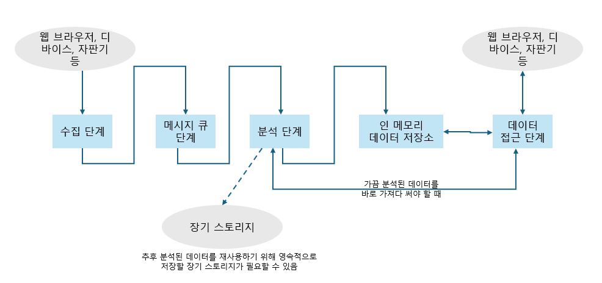
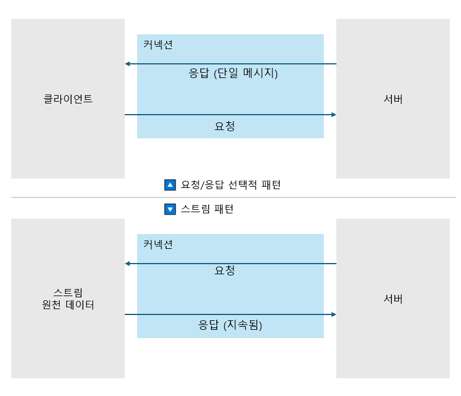

# 스트리밍 데이터 아키텍처

- 책을 통해 전달하고자 하는 목표
  - 전체 스트림 데이터 파이프라인을 구성 : 모든 단계에서 고려해야 하는 trade off 이해
  - 비즈니스 요구사항 또는 관심 분야에 따라 각 단계에서 어떤 소프트웨어를 골라야 하는지 가이드 라인 
- 목차
  1. 스트리밍 데이터 소개
     - 이 아키텍처를 통해 데이터 파이프라인이 각 단계를 어떻게 이어주는지
     - 실시간 시스템이란 무엇인가 (feat.인더모먼트 시스템)
     - 보안의 중요성
  2. 데이터 수집 : 클라이언트에서 데이터 가져오기
     - 데이터 수집단계에 적용할 수 있는 프로토콜
     - 확장 방법과 내결함성 : 확장 가능하면서도 안정적인 서비스
  3. 데이터 파이프라인 분리 : 수집 단계에서 데이터 전송
     - 중앙에 메시지 큐 단계를 사용하여 수집한 데이터를 분석 단계와 분리하는 방법
     - 메시지 유실 방지 방법, 메시지 전달 시맨틱 
  4. 스트리밍 데이터 분석 
     - 분산 스트림 프로세싱 프레임워크의 공통 아키텍처 패턴 
     - 메시지 전달 시맨틱, 상태 처리 방식, 내결함성 필요 이유
  5. 데이터 분석을 위한 알고리즘
     - 스트림 쿼리 시스템
     - 시간을 다루는 방법
     - 4가지 취합 알고리즘
     - 4장이 분산 스트림 프로세싱 엔진에 대한 내용이라면, 5장은 어떤 방식으로 구현할 지에 대한 내용 
  6. 분석 또는 수집한 데이터 저장 
     - 분석 중 또는 분석 후에 처리된 데이터를 인메모리 데이터 저장소에 저장하는 방법
  7. 데이터를 접근 가능하도록 만들기 
     - 클라이언트에게 스트림 데이터를 정송하는데 사용하는 여러 통신 패턴과 프로토콜
     - 비즈니스 요구사항에 따라 선택하는 기준
  8. 컨슈머 디바이스에서 데이터 접근 시 가능성과 한계 
     - 클라이언트를 구축할 때 염두에 둬야할 개념
     - 스트리밍 시스템의 한 부분이 될 클라이언트를 구현할 때 필요한 부분 
- 관련 링크
  - 깃 헙 : https://www.github.com/bjpublic/streaming-data

## 1. 스트리밍 데이터 시스템
- 클라이언트가 데이터를 필요로 하는 시점에 데이터를 가져가서 처리할 수 있도록 구현하는 것 
- 클라이언트가 데이터를 요청하는 그 시점에 서버에서 어떤 데이터를 어떻게 전달할지 구현하는 것에 집중
## 2. 데이터 수집
### 일반적인 통신 패턴 종류   
  - 요청/응답 패턴
    - 서버가 지연 없이 즉각적으로 응답하여 작업을 완료하는 것을 목표로 할 때 사용 
    - 요청과 응답은 하나의 네트워크 연결에서 이루어 진다. 
      - 비동기 방식을 이용하여 성능을 개선하기도 함 : 요청을 보낸 뒤, 응답이 오기 전까지 클라는 다른 일을 수행
    - 동작
      1. 클라이언트 애플리케이션이 서버에 명령 하거나 데이터 요청
      2. 서버는 클라이언트로 응답 보냄
  - 요청/확인 응답 패턴
    - 요청/응답 패턴과 유사하지만 서버에서 반환하는 응답이 필요하지 않고 요청을 정상적으로 받았는지만 확인하고 싶을 때 사용 
  - 발행/구독 패턴
    - 메시지 기반 데이터 시스템에서 일반적으로 사용
    - 프로듀서가 브로커에게 메시지를 전달하고, 메시지는 논리적인 그룹으로 나뉠 수 있는 토픽으로 전송되며, 전송한 다음 토픽을 구독하는 모든 컨슈머에게 메시지가 전송된다.
  - 단방향 패턴
    - 시스템이 응답이 필요하지 않는 경우 사용 
  - 스트림 패턴 
    - 서버가 클라이언트처럼 운영되는 기존과는 정반대의 형태, 지속적으로 데이터를 응답으로 보내는 특징을 가진다.
    
