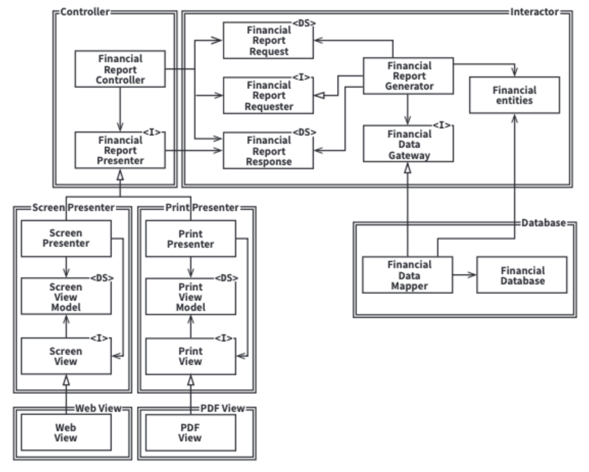
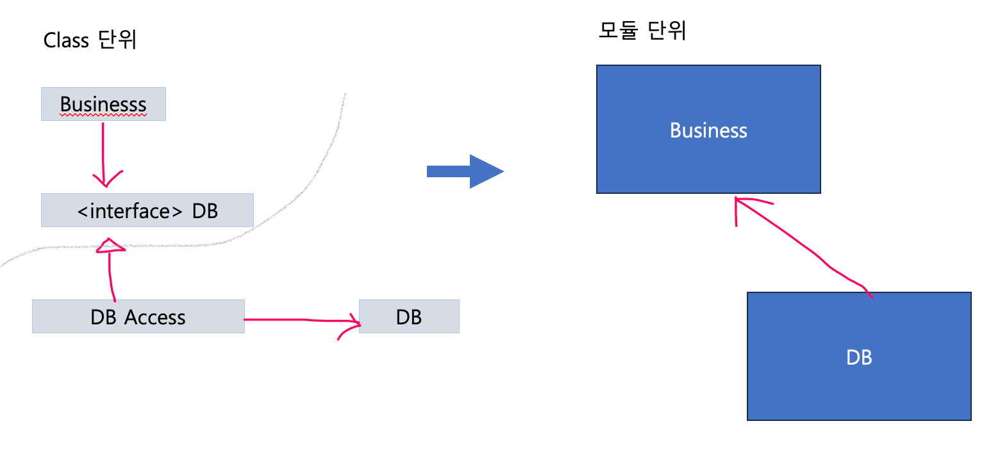

## 1부. 개요
### 소프트웨어 아키텍처의 목표는 필요한 시스템을 만들고 유지보수하는데 투입되는 인력을 최소화하는데 있다.

### 두 가지 가치 - 행위와 구조 
- 행위 : 이해관계자를 위해 기계가 수익을 창출하거나 비용을 절약하도록 만든다.
- 구조 : 기계의 행위를 쉽게 변경할 수 있도록 한다. 
- 새로운 요청사향이 발생할 때마다 바로 이전의 변경사항을 적용하는 것보다 조금 더 힘들어지는데, 시스템의 형채와 요구사항의 형태가서로 맞지 않기 때문이다. 

## 2부. 프로그래밍 패러다임
- 아래 패러다임들은 코드를 작성하는 방식의 형태를 한정시킴으로써 유용한 것이 됐다. 
- 그리고 처음 소프트웨어의 핵심은 여전히 그대로다. 순차, 분기, 반복 
### 1. 구조적 프로그래밍
- 제어흐름에 대한 제약 : goto문의 금지
  - 이로써 모듈을 증명 가능한 더 작은 단위로 재귀적으로 분해할 수 있게되고
  - 이는 결국 모듈을 기능적으로 분해할 수 있음을 뜻한다.
  - 따라서 프로그래머는 대규모 시스템을 모듈과 컴포넌트로 나눌 수 있고
  - 모듈과 컴포넌트는 입증할 수 있는 아주 작은 기능들로 세분화할 수 있다.
### 2. 객체지향 프로그래밍
- 다형성을 안전하고 편리하게 적용할 수 있는 매커니즘
- 플러그인 아키텍처를 적용할 수 있게 됨 , 장치독립적, 프로그램이 다른 장치에서도 동일하게 동작할 수 있도록 만드는 것
- 의존성 역전
  - 전형적인 호출 트리에서 소스 코드 의존성의 방향은 반드시 제어흐름을 따르게 된다. 
- 의존성의 방향이 제어가 가능해지면서 업무 규칙을 포함하는 컴포넌트는 UI와 데이터베이스를 포함하는 컴포넌트에 의존하지 않는다.
  - 고수준의 정책을 포함하는 모듈은 저수준의 세부사항을 포함하는 모듈에 대해 독립성을 보장 받음.
### 3. 함수형 프로그래밍
- 람다계산법
- 변수가 변경되지 않는다.
  - 경합 조건, 교착상태 조건, 동시 업데이트 문제가 모두 가변 변수로 인해 발생
  - 자원(프로세서, 저장공간)의 한계로 구현에 어느 정도의 타협이 필요한데, 그 중 하나는 애플리케이션 내부의 서비스를 가변/불변 컴포넌트로 분리하는 것이다. 
   - 이벤트소싱 : 상태가 아닌 트랙잭션을 저장하는 전략. 상태가 필요해지면 단순히 상태의 시작점부터 모든 트랜잭션을 처리한다. 

## 3부. 설계 원칙 - SOLID
- 기능
  - 함수와 데이터 구조를 클래스로 배치하는 방법 설명 
  - 이들 클래스를 서로 결합하는 방법 설명
- 목적
  - 변경에 유연한 소프트웨어
  - 이해하기 쉬운 
  - 많은 소프트웨어 시스템에 사용될 수 있는 컴포넌트의 기반이 된다.
- 구성
  - SRP (Single Responsibility Principle) `단일 책임 원칙` : 하나의 모듈은 오직 하나의 액터에 대해서만 책임져야 한다. 
  - OCP (Open-Closed Principle) `개방 폐쇄 원칙` : 기존 코드를 수정하지 않고 기능 확장이 가능해야 한다.
  - LSP (Liskov Substitution Principle) `리스코프 치환 원칙` : 상호 대체 가능한 구성요소를 이용해 소프트웨어 시스템을 만들 수 있으려면, 이들 구성요소는 반드시 서로 치환 가능해야 한다. 
  - ISP (Interface Segregation Principle) `인터페이스 분리 원칙` : 이 원칙을 따르면 소프트웨어 설계자는 사용하지 않은 것에 의존하지 않는다. 
  - DIP (Dependency Inversion Principle) `의존성 역전 원칙` : 고수준 정책을 구현하는 코드는 저수준 세부사항을 구현하는 코드에 절대 의존해서는 안된다.

### 단일 책임 원칙
- 단일 책임 원칙은 메서드와 클래스 수준의 원칙
- 사례
  - 우발적 중복 : 급여 애플리케이션, 서로 다른 액터가 같은 함수를 공유하고 있단 사실을 모르고 한 쪽의 요구사항에 맞춰 수정 시 문제가 생긴다.
  - 병합 : 액터가 서로 다른 기능 구현을 위해 같은 클래스를 수정하게 될 시, 병합이 발생한다. 
    - 해결책 : 데이터와 메서드를 분리 
- Facade Pattern 퍼사드 패턴 
  - 퍼사드 패턴은 소프트웨어 공학의 디자인 패턴으로 구조 패턴의 범주에 속한다. 
  - 클래스, 라이브러리 또는 API로 구성된 복잡한 시스템에 단순화된 인터페이스를 제공 
  - 주요 목표는 복잡성을 숨김으로써 하위 시스템을 더 쉽게 사용할 수 있도록 하는 더 높은 수준의 인터페이스를 제공하는 것이다. 
  - 코드 : src/cleanArchitecture/srp/facade

### 개방 폐쇄 원칙 
- 사례
  - 재무보고표를 프린트할 때, 음수 금액은 빨간색으로 출력되도록 표시해왔다. 그런데 흑백 프린터로 뽑는 경우가 생겨 해당 상황에서는 음수를 괄호처리를 함으로써 표시한다.
  - 단일 책임 원칙을 적용하면, 재무데이터 검사 -> 보고서용 데이터 생성 -> 포맷팅 (컬러 or 흑백) 해당 방식으로 체계화 해서 쉽게 가능할 것 이다.
- 책임을 분리했다면 두 책임 중 하나에서 변경이 발생하더라고 다른 하나는 변경되지 않도록 소스 코드 의존성도 확실히 조직화 해야한다. 
  - 처리 과정을 클래스 단위로 분할
  - 클래스를 컴포넌트 단위로 구분
  
- 컴포넌트 혹은 클래스의 관계는 단방향으로 이루어 져야 한다. 이는 변경으로부터 보호하려는 컴포넌트를 향하도록 한다. 
  - 인터페이스는 의존성 역전을 가능하게 하여 단방향을 가능하게 한다. 

### 리스코프 치환 원칙
- 공통의 조건을 잘 지켜서, 객체가 서로 치환될 수 있게 해야 확장성이 좋아진다는 것.
- 자바에서는, 상속과 인터페이스를 잘 이용하면 어느정도는 지켜질 수 있으나
- 책의 예시처럼 REST 서비스의 URL 필드 규칙을 어긴다면 확장이 어려워지기 떄문에 시스템적 치환 원칙은 일부러라도 신경을 써줘야 한다. 

### 인터페이스 분리 원칙
- 13장 컴포넌트 응집도와 관련있음
- 많은 컴포넌트와 관계가 생길수록 변경 파급도가 커진다

### 의존성 역전 원칙 
- 추상에 의존하며 구체에는 의존하지 않는 시스템
- 변경되지 않는다면 의존할 수 있다. 피하고자 하는 것은 변동성이 큰 구체적인 요소이다.
- 구체적이며 변동성이 크다면 절대로 그 이름을 언급하지 말라
- 코딩 실천법
  - 변동성이 큰 구체 클래스를 참조하지 말라. 대신 추상 인터페이스를 참조하라
  - 변동성이 큰 구체 클래스로부터 파생하지 말라. 상속을 이용하는데 신중을 가해라
  - 구체 함수를 오버라이드 하지 말라. 차라리 추상 함수로 선언하고 구현체들에서 각자의 용도에 맞게 구현
- 팩토리
  - 사실상 모든 언어에서 객체를 생성하려면 해당 객체를 구체적으로 정의한 코드에 대해 **소스 코드 의존성**이 발생
  - 이러한 문제를 해결하기 위해 추상팩토리를 이용 

## 4부. 컴포넌트 원칙 
- 컴포넌트는 배포 단위이다. 
- 무어의 법칙에 따라 컴퓨터의 속도는 빨라지고 로드와 링크를 동시에 할 수 있게 되었다.
- 이렇게 컴포넌트 플러그인 아키텍처가 등장했다. : 런타임에 플러그인 형태로 결합할 수 있는 동적 파일 링크 파일(소프트웨어 컴포넌트)
### 컴포넌트 응집도
- 어떤 클래스를 어느 컴포넌트에 포함시켜야 할까? 
- 아래 규칙 세가지를 참고하자
  - REP;Reuse/Release Equivalence Principle : 재사용/릴리스 등가 원칙
    - 재사용 단위는 릴리스 단위와 같다.
    - 컴포넌트를 구성하는 모든 모듈은 서로 공유하는 중요한 테마나 목적이 있어야 한다. 
    - 하나의 컴포넌트로 묶인 클래스와 모듈은 반드시 함께 릴리스할 수 있어야 한다. 
  - CCP;Common Closure Principle : 공통 폐쇄 원칙
    - 동일한 이유로 동일한 시점에 변경되는 클래스를 같은 컴포넌트로 묶어라 
  - CRP;Common Reuse Principle : 공통 재사용 원칙 
    - **같이 재사용되는 경향이 있는 클래스와 모듈들을 같은 컴포넌트에 포함해야 한다.** 
    - 한 컴포넌트에 속한 클래스들을 더 작게 그룹지을 수 없다. (이미 그 컴포넌트의 모든 클래스가 서로 관계가 있다는 전제하에)
    - 그렇기에, 다른 컴포넌트에서 컴포넌트의 일부 클래스에 의존하더라도 그 컴포넌트 안의 모든 클래스에 의존한다고 인지 해야 한다. 
    - **따라서 강하게 결합되지 않은 클래스들을 동일한 컴포넌트에 위치시켜서는 안된다.** 

  - 개발팀이 현재 관심을 기울이는 부분을 충족하는 위치를 찾는 것이 중요
  - 프로젝트 초기에는 CCP가, 개발 가능성이 재사용성보다 중요하여 더 중요하다.
### 컴포넌트 결합 
- ADP : 의존성 비순환 원칙
  - 컴포넌트 의존성 그래프에 순환이 있어서는 안 된다. 
  - 해결책 : 개발환경을 릴리스 가능한 컴포넌트 단위로 분리하는 것 
    - 각자 담당하는 컴포넌트를 동작하도록 만든 후 릴리스하여 다른 개발자가 사용할 수 있도록 하며 릴리스 번호를 부여한다.
    - 이 컴포넌트를 사용할 또 다른 컴포넌트는 변경된 사항을 적용할 것인지 스스로 결정할 수 있으며 필요시 자신만의 공간 한정 해당 컴포넌트의 내용을 수정할 수 있다.
    - 시스템 전체를 릴리스해야 할 때가 오면 릴리스 절차는 상향식으로 진행된다.
  - 순환이 생긴다면, 거대한 컴포넌트 모음을 다 의존해야 되므로 단위테스트도 힘들어지며 한 컴포넌트를 고치는데 신경써야 할 것도 커진다.
  - 또한 빌드 순서가 모호해진다.
  - 비순환을 위한 주요 매커니즘
  - 의존성 역전 원칙
    - 순환 구조 변경 전
      - 
    - 순환 구조 변경 후
      - 
    - User가 필요로 하는 메서드를 제공하는 인터페이스를 생성한다.
    - 이 인터페이스를 Entites에 위치시키고
    - Authorizer에서는 이 인터페이스를 상속받는다. 
    - 이렇게 하면 Entities와 Authorizer사이의 의존성을 역전시킬 수 있다. 
  - 컴포넌트 구조 변경
    - /img/순환구조 - 새로운 컴포넌트 생성.png
- 컴포넌트 구조는 하향식으로 설계 될 수 없다.
  - 컴포넌트 의존성 다이어그램은 애플리케이션의 기능을 기술하는 일과는 관련이 없다.
    - **애플리케이션의 빌드 가능성**과 **유지보수성**을 보여주는 지도와 같다.
  - 시스템이 성장하고 변경될 때 함께 진화한다. 
    - 우리는 애플리케이션이 계속 성장함에 따라 재사용 가능한 요소를 만드는 일에 관심이 가고
    - 이 시점이 되면 컴포넌트를 조합하는 과정에서 공통 재사용 원칙(CRP)가 영향을 미치기 시작한다.
    - 결국 순환이 발생하면 ADP가 적용되며 가다듬어 딘다.
    - 아무런 클래스를 설계하지 않은 상태에서 의존성 구조를 설계 한다면 특성을 파악할 수 없기에 컴포넌트 의존성 구조는 시스템의 논리적 설계에 발맞춰 성장해야 한다.
- SDP; Stable Dependencies Principle : 안정된 의존성 원칙
  - 안정성의 방향으로 더 안정된 쪽에 의존하라.
    - 컴포넌트 안쪽으로 들어오는 의존성이 많아지면 안정적이다. 
    - 의존 당하지 않을 수록 안정적이지 않다. 
    - 불안정성(I) =  Fan-out / (Fan-in + Fan-out)  ; 0 <= I <= 1 
      - Fan-out : 바깥으로 나가는 의존성. 외부 클래스에 의존하는 컴포넌트 내부의 클래스 개수
      - Fan-in : 안으로 들어오는 의존성. 내부의 클래스에 의존하는 컴포넌트 외부의 클래스 개수 
      - I가 0에 가까울수록 안정성이 있다. 
  - 컴포넌트 다어그램은 아래에 안정적인 컴포넌트를 위치하는 것이 관례이다. 
    - 모든 의존성을 I가 감소하는 방향 (아래)로 향해야 한다. 
- SAP; Stable Abstractions Principle : 안정된 추상화 원칙
  - 컴포넌트는 안정된 정도만큼만 추상화되어야 한다. 안정성과 추상화 정도 사의의 관계
  - 고수준 정책을 불안정성을 0으로 만들면서 변경에 유연하기 위해 개방폐쇄 원칙을 적용한다. (추상클래스 이용!)
    - 안정적인 컴포넌트라면 반드시 인터페이스와 추상 클래스로 구성되어 쉽게 확장할 수 있어야 하며
    - 불안정적인 컴포넌트는 반드시 구체 컴포넌트여야 한다. 
  - 배제구역
    - 쓸모없는 구역 : 불안정적인데 추상적인 
    - 고통의 구역 : 안정적인데 구체적인 
  - 안정성과 추상화 정도의 그래프에서 주계열에 가까운 정도의 특성을 가진 컴포넌트 구조를 설계하는 것이 이상적
## 5부. 아키텍처
### 아키텍처란
- 시스템을 컴포넌트로 분할하는 방법, 분할된 컴포넌트를 배치하는 방법, 컴포넌트가 서로 의사소통하는 방식에 따라 결정되는 것
- 그 형태는 아키텍처 안에 담긴 소프트웨어 시스템이 **쉽게 개발, 배포, 운영, 유지보수**되도록 만들어잔다.
  - 개발 : 개발자가 개발하기 쉽도록
  - 배포 : 단 한 번에 쉽게 배포할 수 있도록 만들 것
  - 운영 : 아키텍처가 개발자에게 시스템의 운영 방식을 잘 드러내야 한다. 
  - 유지보수 : 탐사에 대한 비용 줄일 것
- 이러한 일을 용이하게 만들기 위해서는 **가능한 많은 선택지**를 **가능한 한 오래 남겨두는** 전략을 따라야 한다. 
  - 중요하지 않은 세부사항에 대한 선택지는 열어둬라. 
      - 정책 : 시스템의 진정한 가치가 살아있는 곳
      - 세부사항 : 사람, 외부 시스템, 프로그래머가 정책과 소통할 때 필요한 요소
  - 세부사항을 정책에 무관하게 만들 수 있는 형태의 시스템을 구축하여 세부사항을 결정하는 일을 미룰 수 있게 한다. 
- 주된 목적은 시스템 생명주기를 지원하는 것, 비용 최소화, 생산성 최대화

### 독립성
- 좋은 아키텍처는 시스템의 유스케이스/운영/개발/배포를 지원해야 한다. 
- 유스케이스
  - 시스템의 의도를 지원해야 한다는 뜻
  - 좋은 아키텍처를 갖춘 애플리케이션은 유스케이스가 한눈에 드러난다. 
  - 계층 결합 분리
    - 유스케이스틑 시스템을 분할하는 매우 자연스러운 방법 
    - UI/ 애플리케이션에 특화된 업무규칙/ 애플리케이션과는 독립적인 업무규칙/ 데이터베이스  등으로 나눔
    - 이후 유스케이스가 추가 되면, UI를 또 주문 추가 유스케이스 UI/ 삭제 유스케이스 UI로 분리 해야 한다.
    - 또한 각 유스케이스가 UI와 DB의 서로 다른 관점을 사용하게 되면, 새로운 유스케이스를 추가하더라고 기존 유스케이스에 영향을 주지 않을 것이다. (관점 지향 프로그래밍 관련)
- 운영
  - 요구와 관련된 각 유스케이스에 걸맞은 처리량과 응답시간을 보장하는 구조화를 한다.
- 개발 
  - 콘웨이의 법칙 : 조직의 의사소통 구조와 동일한 구조의 설계를 만들어 낸다.
  - 개발 독립성
    - 컴포넌트가 분리되면 팀 사이의 간섭은 줄어든다. 
- 배포
  - 배포 독립성
    - 유스케이스와 계층의 결합이 분리 되면 자연스럽게 배포 측면에서도 고도의 유연성이 생긴다. 
    - 새로운 유스케이스를 추가하는 일은 시스템의 나머지는 그대로 둔 채 새로운 jar파일이나 서비스 몇 개를 추가하는 정도로 단순하다.
- 결합 분리 모드
  - 계층과 유스케이스의 결합을 분리하는 방법
  - 소스 수준 분리
    - 모든 컴포넌트가 같은 주소 공간에서 실행되고, 서로 통신할 때는 간단한 함수 호출을 사용 
    - 컴퓨터 메모리에는 하나의 실행 파일만이 로드
    - 모노리틱 구조라고도 한다. 
  - 배포 수준 분리 
    - jar 파일, DIL, 공유 라이브러리와 같이 배포 가능한 단위들 사이의 의존성 제어 가능 
    - 이를 통해 한 모듈의 소스 코드가 변하더라도 다른 모듈을 재빌드하거나 재배포 하지 않도록 만듬
    - 프로세스 간 통신, 소켓, 공유 메모리를 통해 컴포넌트가 다른 프로세스에 상주해도 통신 가능 
    - 결합이 분리된 컴포넌트가 jar파일, DIL과 같이 배포할 수 있는 단위로 분할된것이 포인트
  - 서비스 수준 분리
    - 의존 수준을 데이터 구조 단위까지 낮출 수 있다.
    - 네트워크 패킷을 통해서만 통신 
    - 모든 실행 가능한 단위는 바이너리 변경에 대해 서로 완전히 독립된다 . (예시 - 마이크로서비스) 
  - 좋은 아키텍처는 시스템이 모노리틱 구조로 태어나서 단일 파일로 배포되더라도, 이후에는 독립적으로 배포 가능한 단위들의 집합으로 성장하고,
  - 또 독립적인 서비스나 마이크로서비스 수준까지 성장할 수 있도록 만들어져야 한다. 또한 상황이 바뀌면 진행 방향을 거꾸로 돌려 원래 형태로 되돌릴 수도 있어야한다. 
- 
### 경계:선긋기 
- 소프트웨어 아키텍처는 선을 긋는 기술이다.
- 경계는 소프트웨어 요소를 서로 분리하고, 경계 한편에 있는 요소가 반대 편에 있는 요소를 알지 못하도록 막는다.
- 이른결정(결합)을 조심하라
  - 아키텍트에게 있어 가장 주요한 핵심은 유스케이스 (비즈니스)이다.
  - 이와 관련이 먼 프레임워크, DB, 웹 서버, 유틸리티 라이브러리, 의존성 주입과 같은 선택 사항은 최대한 뒤에 결정해도 큰 영향이 없게 설계 해야 한다.
  - 입력과 출력은 중요하지 않은 쪽에 속한다.
    - 화면이 안 나와도 그 뒤에 모델은 자기 자신의 역할을 충실히 하고 있지 않은가
    - 모델에게 중요한 건 화면 같은 인터페이스가 아닌 비즈니스이다. 
  - 단일 책임 원칙이 경계의 위치를 알려 줄 것
- How
  - SW 아키텍처에 경계선을 그리려면 먼저 시스템을 컴포넌트 단위로 분할 한 뒤
  - 컴포넌트 사이의 화살표가 핵심업무 방향도록 컴포넌트 소스를 배치한다. 
  

### 업무규칙 (비즈니스)에 대하여
- 프로그램을 업무 규칙 - 플러그인으로 구분하려면 업무 규칙이 뭔지 알아야 한다.
- 업무규칙은 보통 데이터를 요구하기에 이를 핵심 업무 데이터라 부르겠다.
- 엔티티 
  - 핵심 업무를 기반으로 동작하는 일련의 조그만 핵심 업무 규칙을 구체화 한 것
  - 이 클래스는 업무의 대표자로서, 독립적으로 존재해야 한다.
    DB, 사용자 인터페이스, 서드파티 프레임워크에 대한 고려사항으로 오염되지 않아야 한다.
- 유스케이스
  - 자동화된 시스템이 사용되는 방법을 기술한다.
  - 엔티티와 달리 애플리케이션에 특화된 업무규칙이다. (엔티티보다 좀더 구체적인 개념)
  - 기능에 필요한 입력, 처리 단계 기술, 출력이 구성요소이다.
  - 엔티티 내부의 핵심 업무 규칙을 어떻게, 그리고 언제 호출할지를 명시하는 규칙이다. 
- 요청 및 응답
  - 업무 규칙에 고려되지 않는 사항이므로 모델과 구별되어야 한다.

### 소리치는 아키텍처
- 아키텍처의 테마가 확실히 보여야 하며, 유스케이스 주도 접근법에 걸맞는 주제이다.
- 프레임워크를 전혀 준비하지 않더라도 필요한 유스케이스 전부에 대해 단위테스트가 가능하다면 소리치는 아키텍처이다. 

---
### 와 닿는 문장
- 소프트웨어 개발자인 당신도 이해관계자임을 명심하라.
- 패러다임들은 코드를 작성하는 방식의 형태를 한정시킴으로써 유용한 것이 됐다. 
- 컴포넌트 구조는 하향식으로 설계 될 수 없다. 
- 우발적 중복과 진짜 중복을 구분하라. 
- 좋은 아키텍처는 시스템이 모노리틱 구조로 태어나서 단일 파일로 배포되더라도, 이후에는 독립적으로 배포 가능한 단위들의 집합으로 성장하고,
  또 독립적인 서비스나 마이크로서비스 수준까지 성장할 수 있도록 만들어져야 한다. 또한 상황이 바뀌면 진행 방향을 거꾸로 돌려 원래 형태로 되돌릴 수도 있어야한다. 
- 결국 뛰어난 아키텍트는 변경을 예측하여 큰 무리 없이 반영할 수 있도록 만드는 사람이다. 