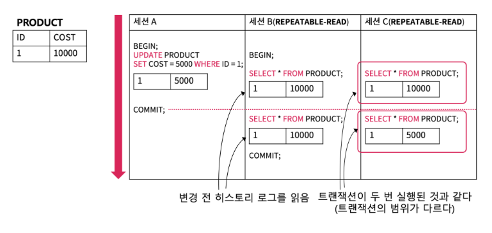

# 데이터베이스의 이해 
## 트랜잭션
- 데이터베이스 상태를 변경하기 위한 작업의 논리적단위

### 히스토리 로그
- DBMS에서는 데이터베이스의 상태를 변경시키는 질의를 기록하기 위해 히스토리 로그를 이용한다.
- 현재 세션에서는 commit을 안해도 히스토리로그로 질의를 기록했기 때문에 질의 적용된 데이터 값이 출력된다.
- 히스토리로그에 따른 값 반영은 세션별 고립성 단계별로 다르기도 하다. 

### ACID
- Atomicity 원자성, Consistency 일관성, Isolation 고립성, Durability 지속성
- 원자성 
  - 하나의 트랜잭션은 원자적 수행단위이다.
  - 트랜잭션의 모든 작업들은 부분만 수행될 수 없고, 완전히 수행되거나 수행되지 말아야 한다. (All or Nothing)
- 일관성
  - 트랜잭션이 완료되고 난 후에도 데이터베이스의 무결성 제약조건이나 다른 제약 조건들에 위배하지 않아야 한다.
- 고립성
  - 여러 트랜잭션이 동시에 실행되도, 따로 따로 연속적으로 수행한 것 처럼 실행되어야 한다.
  - 예를 들어 transaction 1,2,3,4가 동시에 수행되더라도, 1 -> 2 -> 3 ->4 와 같이 수행되어야 한다.
- 지속성
  - 완료된 트랜잭션은 데이터 베이스에 영구적으로 보존되어야 한다. 
  - 만약 완료 전에 컴퓨터가 꺼진다면 데이터는 원자성 원칙에 따라 트랜잭션이 수행되기 전으로 돌아간다. 

### Lock
- 데이터를 수정하거나 읽는 권한을 조절해서 동시성 문제를 제거하는 것
- Read Lock == Shared Lock == 공유 락
  - 데이터 읽기 O , 수정 X
  - 해당 락이 해제되면 데이터 수정 가능해짐
- Write Lock == Exclusive Lock == 배타 락
  - 한 세션만 접근 가능
  - 잠금을 건 세션만 데이터를 읽기 O, 수정 O
- 묵시적인 Lock
  - 명시적으로 잠금 설정을 안해도, 논리상 DBMS에서 자동으로 잠금 처리 되는 것
  - 데이터를 변경하는 구문인 `Update` 구문이 사용되면, 묵시적으로 배타 락이 걸리며, 락을 먼저 획득한 세션이 잠금을 해제해야 다른 세션에서 사용 가능
- Record Lock == Intention Lock
  - 레코드 단위로 잠금을 건다. 범위를 최소화 하여 Lock으로 인한 문제를 줄여준다. 
- LOCK WAIT TIMEOUT
  - 잠금이 해제될 때까지 무한정 기다려야 하므로 대기하는 시간의 제한을 두어 락을 얻는데 실패했다고 알려준다.

### 트랜잭션 동시성과 고립성
- 동시성과 고립성은 trade off 관계를 가진다
- 따라서 서비스 운영 시 서비스의 성격에 알맞는 격리 수준을 선택해야 한다.
- 고립성
  - 여러 트랜잭션들이 동시에 실행되어도 다른 트랜잭션들로부터 고립되어 실행되는 것처럼 보여야 하는 성질
  - DBMS에서는 고립성에 단계를 두어 고립되는 것처럼 보일지 아닐지 선택할 수 있다.
- 고립성에 단계를 나누는 이유 
  - 대부분의 서비스는 읽기 관련 질의 요청 비율이 높음
  - 이런 상황에서 Lock의 개념만 존재한다면, 대기 시간이 길어진다. 
- 고립성의 네가지 단계 : 단계가 높을 수록 고립성이 높아지고, 대기 시간이 길어 진다.
  1. READ-Uncommitted
     - 특정 트랜잭션에서 데이터를 변경했으나, 다른 트랜잭션에서 커밋되지 않은 데이터를 읽을 수 있음
     - 커밋 전에는 히스토리 로그 / 커밋 후에는 테이블에서 데이터를 읽는다. (모든 세션이)
     - 다른 세션에서 데이터 수정중인 세션에서 Rollback 될 수도 있는 데이터를 읽을 수 있으므로 주의해야 함
  2. READ-committed
     - 특정 트랜잭션에서 데이터를 변경했어도 커밋되지 않았으면 변경되기 전의 데이터를 읽는다.
     - 커밋 전/후 모두 테이블에서 데이터를 읽는다.
     - 하나의 트랜잭션 안에서 select를 수행할 때마다 데이터가 동일하다는 보장이 없음
  3. Repeatable-READ
     - 다른 트랜잭션의 커밋 여부와 상관없이 트랜잭션 시작 시점의 값을 읽는다.
     - 다른 트랜잭션에 영향을 받지 않고 동일한 데이터를 가져온다. 
     
     - 한 트랜잭션에서 READ 되는 데이터 수가 달라질 수 있다.
  4. Serializable
     - 명시적인 트랜잭션 내에서 데이터 변경 질의가 전달될 경우, 명시적인 트랜잭션 내에서 락을 가진 트랜잭션만 데이터에 접근 가능
     - 동시성 문제가 발생하지 않는다. 