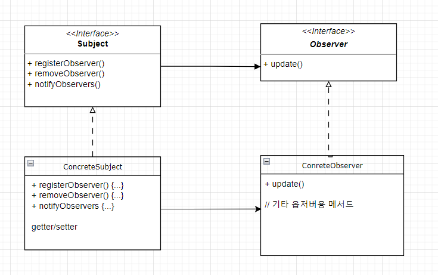

# 📒 헤드퍼스트 디자인 패턴 
## 목차 및 주제 
1. 디자인 패턴 소개와 전략 패턴
   - 상속과 인터페이스 
   - 바뀌는 부분과 그렇지 않은 부분 분리
   - 동적으로 행동 지정
   - 두 클래스를 합치는 방법
2. 옵저버 패턴 : 객체들한테 연락 돌리기
3. 데코레이터 패턴 : 객체 꾸미기 
4. 팩토리 패턴
   - 의존성 뒤집기 원칙 적용 
5. 싱글톤 패턴 
6. 커맨트패턴 
7. 어댑터/퍼사드 패턴
8. 템플릿 메소드 : 알고리즘 캡슐화 
9. 반복자/컴포지트 패턴 : 컬렉션 관리 
10. 상태 패턴 : 객체의 상태 바꾸기
11. 프록시 패턴 : 객체 접근 제어하기 
12. 복합 패턴 : 패턴을 모아 패턴 만들기

## 디자인 원칙
1. 애플리케이션에서 달라지는 부분을 찾아내고, 달라지지 않는 부분과 분리한다. 
2. 구현보다는 인터페이스에 맞춰서 프로그래밍 한다. (상위 형식에 맞춰 프로그래밍한다.)
3. 상속보다는 구성을 활용한다. 
   - 서브클래스를 만드는 방식으로 행동을 상속받으면 그 행동은 컴파일할 때 완전히 결정 되며 모든 서브클래스에서 똑같은 행동을 상속 받는다.
   - 구성으로 객체의 행동을 확장하면 실행 중에 동적으로 행동을 설정할 수 있다. 
4. 상호작용하는 객체 사이에는 가능하면 느슨한 결합을 사용해야 한다. 
5. OCP : 클래스는 확장에는 열려 있어야 하지만 변경에는 닫혀 있어야 한다. 
6. 추상화된 것에 의존하게 만들고 구상 클래스에 의존하지 않게 한다. 

### 상속과 구현 
- 코드 상속 시, 필요하지 않은 기능 또한 정의해주어야 함. 객체(명사 단위의) 개념을 상속하는 객체를 만들어 동작을 정의 하는 모양새임
- 인터페이스 제작 시, 동작을 기준으로 만든 뒤, 동작을 사용할 객체에서 선택하여 여러개의 인터페이스를 구현하는 방식으로 전개 하면 더 유연하게 설계할 수 있다. 
  - 그리고 제작된 동작 인터페이스의 구현체를 프로그램 동작 중에도 바꿀 수 있도록, setter 메소드를 클래스에 포함시켜 더 유연한 설계 가능
  
### 전략 패턴
- 알고리즘군을 정의하고 캡슐화해서 각각의 알고리즘군을 수정해서 쓸 수 있게 한다.

## 옵저버 패턴
- 📁 src/designPattern/observer
- 한 객체의 상태가 바뀌면 그 객체에 의존하는 다른 객체에게 연락이 가고 자동으로 내용이 갱신되는 방식으로 일대다 의존성을 정의 
  - 주제(Subject)가 데이터(상태)를 저장하고 제어하며 옵저버는 상태를 사용하지만, 반즈시 소유할 필요는 없다. : 일대다 관계
  - 
- 옵저버패턴에서 만드는 느슨한 결합
   - 주제는 옵저버가 특정 인터페이스를 구현한다는 사실만 안다.
   - 실행중 옵저버에 변경을 줄 수 있음. 주제는 Observer 인터페이스를 구현하는 객체의 목록에만 의존하므로.
   - 새로운 형식의 옵저버를 추가할 때도 주제를 변경할 필요가 없음. 새로운 클래스에서 Observer 인터페이스를 구현하고 옵저버로 등록하기만 하면 됨
   - 주제와 옵저버는 서로 독립적으로 재사용할 수 있다. 
   - 주제나 옵저버가 달라져도 서로에게 영향을 미치지 않는다. 
- 주제에서 옵저버로 알림이 가는 순서에 옵저버가 의존하지 않도록 해야 한다. 
- 주제가 옵저버로 데이터를 보내는 push 방식보다는 옵저버가 필요할 때 주제를 pull 해오는 방법이 더 나은 경우가 많다. 
  - 주제가 자신의 데이터에 관한 게터 메서드를 가지게 만들고 필요한 데이터를 당겨올 때 해당 메소드를 호출하도록 옵저버를 고쳐준다. 

## 데코레이터 패턴
- : 객체에 추가 요소를 동적으로 더할 수 있다. 데코레이터를 사용하면 서브클래스를 만들 때보다 훨씬 유연하게 기능 확장 가능 
- 실행 중에 확장하는 일을 가능하게 한다. 기존 클래스 코드를 바꾸지 않고도 객체에 새로운 기능을 추가할 수 있다. 
- 커피 음료 값을 계산하는 시스템을 예시로 살펴본다. 
  - 📁 src/designPattern/decorator 
  - 음료에 각 첨가물 객체를 필드로 가져와  가격을 산출하는 방법 (X)
  - 특정 음료에서 시작해서 첨가물로 그 음료를 장식하는 방법 (O) : 데코레이터 객체를 '래퍼'객체라고 생각하고 장식 
    ```
    1. DarkRoast 객체를 가져온다.
    2. Mocha 객체로 장식한다.
    3. Whip 객체로 장식한다. 
    4. cost() 메소드를 호출한다. 이때 첨가물의 가격을 계산하는 일은 해당 객체에게 위임한다.
    ```
- 데코레이터의 슈퍼클래스는 자신이 장식하고 있는 객체의 슈퍼클래스와 같다.
- 데코레이터는 자신이 감싸고 있는 객체와 같은 슈퍼클래스를 가지고 있기에 원래 객체가 들어갈 자리에 데코레이터 객체를 넣어도 된다 (다형성)
- 데코레이터는 자신이 장식하고 있는 객체에게 어떤 행동을 위임하는 일 말고도 추가 작업을 수행할 수 있다.  
- 객체는 언제든지 감쌀 수 있으므로 실행 중에 필요한 데코레이터를 마음대로 적용할 수 있다. 
- 구상 구성 요소로 어떤 작업을 처리하는 코드에 데코레이터 패턴을 적용하면 코드가 제대로 작동하지 않는다.
  - 반대로 추상 구성 요소로 돌아가는 코드에는 데코레이터 패턴을 적용해야만 제대로 된 결과를 얻을 수 있다.
  - 구상 구성 요소로 돌아가는 코드를 만들어야 한다면 데코레이터 패턴 사용을 다시 한번 생각해 봐야 한다. 

### 자바 I/O
  - java.io 패키지는 데코레이터 패턴을 바탕으로 만들어졌다. 
  - 파일에서 데이터를 읽어오는 스트림에 기능을 더하는 데코레이터를 사용하는 객체 

## 팩토리 패턴
- 객체를 생성할 때 필요한 인터페이스를 만든다. 어떤 클래스의 인스턴스를 만들지는 서브클래스에서 결정하게 한다. 
- 인스턴스를 만드는 행동을 캡슐화 하는 패턴 
- 사용 장점
  - 객체 생성 코드를 전부 한 객체 또는 메소드에 넣으면 코드에서 중복되는 내용 제거 가능, 관리하기도 쉬움
  - 객체 인스턴스를 만들 때 인터페이스만 있으면 되어 유연성과 확장성이 좋아짐 

### 의존성 뒤집기
- 구상 클래의 의존성을 줄이면 좋다는 사실
- 고수준 모듈과 저수준 모듈이 둘 다 하나의 추상클래스에 의존하게 되는 형식 
- 의존성 뒤집기 원칙을 지키는 방법 (지향점)
  1. 변수에 구상 클래스의 레퍼런스를 저장하지 않는다. : new 연산자를 사용하게 되므로
  2. 구상 클래스에서 유도된 클래스를 만들지 않는다. : 추상 클래스처럼 추상화된 것으로부터 클래스 만들기
  3. 베이스 클래스에 이미 구현되어 있는 메소드를 오버라이드 하지 않는다. : 베이스 클래스가 제대로 추상화 되지 않을 위험. 베이스 클래스에서 메서드를 정의할 때는 모든 서브클래스에서 공유할 수 있는것만 정의 

### 추상 팩토리 패턴
- ```
    public interface PizzaIngredientFactory {
        public Dough createDough();
        public Sauce createSauce();
        ...
    }
    ```
- ```
    public class NYPizzaIngredientFactory impliments PizzaIngredientFactory {
        public Dough creatrDough() {
            return new ThinCrustDough();
        }    
        public Sauce createSauce() {
            return new MarinaSauce; 
        }
        ...
    }
    ```
- ```
    public abstract class Pizza {
        String name;
        Dough dough;
        Sauce sauce;
        ...
        
        abstract void prepare();  // 추상 메서드 : 피자를 만드는 데 필요한 재료를 가져오는 기능, 팩토리에서 가져온다.
        
        // 추상 메서드를 제외한 다른 메서드는 바뀌지 않는다. 
        void bake() { ... }
        void cut() { ... }
    }
    ```
- ```
    public Class ChessPizza extands Pizza {
        PizzaIngredientFactory ingredientFactory;
    
        public ChessPizza(PizzaIngredientFactory igf) {
            this.ingredientFactory = igf;
        }
    
        void prepare() {
            dough = ingredientFactory.createDough();
            ...
        }
        
    }
    ```
- ``` 
    public class NYPizzaStore extends PizzaStore {
        protected Pizza createPizza(String item) {
            Pizza pizza = null;
            PizzaIngredientFactory igf = new  NYPizzaIngredientFactory();  // 어떤 피자를 만드는 원재료 팩토리를 전달할 지 고른다. 
        }
             if (item.equals("chess")) {
                  pizza = new ChessPizza(igf);  // 해당 피자를 만드는데 맞는 재료를 만드는 팩토리를 객체에 전달
             }
             ... 
            
             return pizza  
    }
    ```

## 05. 싱글턴 패턴
- 한 클래스의 인스턴스를 1개만 만든다.
  - 인스턴스를 하나만 만들어도 잘 돌아감
  - 인스턴스가 2개 이상이면 프로그램이 이상하게 돌아가거나 자원을 불필요하게 잡아먹고 결과에 일관성이 없어지는 문제가 생길 수 있다.
- 전역변수로 선언하여 싱글톤을 유지하는건 메모리 성능 상, 당장 사용하지 않는 자원인데 자리를 차지하는 꼴이 된다. 
  - 싱글턴 패턴을 사용하면, 필요할 때만 객체를 만들어 성능을 높인다. 
- ```
  public MyClass 

     private MyClass() {}
     public static MyClass getInstance() {
        return new MyClass; 
     }
  }
  ```


