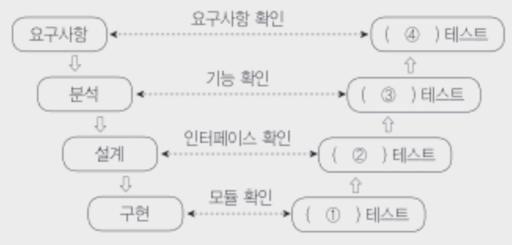

# To-do
- DB 62, 인터페이스 구현 164
- 모의고사 23년 3회 
- 수제비 실기

## 응용 SW 기초 기술 활용 (2)
- 문제 은행 완!
### IP
- IPv4 : 8비트씩 4부분, 총 32비트로 이루어짐
- IPv6 : 16비트씩 8부분, 총 128비트 
  - 주소체계
    - 유니캐스트 : 단일 송신자와 단일 수신자 간의 통신 (1:1)
    - 멀티캐스트 : 단일 송신자와 다중 수신자 간의 통신 (1:N)
    - 애니캐스트 : 단일 송신자와 가장 가까이 있는 단일 수신자 간의 통신 (1:1)
- 서브네팅 : 할당된 네트워크 주소를 다시 여러 개의 작은 네트워크로 나누어 사용하는 것 
- 도메인네임, DNS (도메인 네임을 IP 주소로 변환하는 역할을 하는 시스템)
- OSI 7 Layer : 물데네전세표응
  1. 물리 : 리피터, 허브
  2. 데이터 링크 : 물리적으로 연결된 두 개의 인접한 개방 시스템들 간에 **신뢰성 있고 효율적인 정보 전송**. 오류 제어 등의 기능 수행
  3. 네트워크 : **네트워크** 연결 관리. 경로 제어, **패킷**교환, 트레픽 제어
  4. 전송 : 종단시스템간에 투명한 데이터 전송. **주소 설정**, 게이트 웨이
  5. 세션 : 유지
  6. 표현 : 서로 **다른 데이터 표현 형태**를 갖는 시스템 간의 상호 접속을 위해 필요한 계층
  7. 응용 : 사용자가 OSI환경에 접근할 수 있도록 서비스 제공 
- 네트워크 관련 장비
  - 리피터 : 디지털 신호의 장거리 전송을 위해 출력 전압을 높여 전송하는 장치 
  - 허브 : 가까운 거리의 컴퓨터들을 연결하는 장치, 신호 증폭 기능을 하는 리피터 역할 포함
  - 브리지 : LAN과 LAN을 연결하거나 LAN 안에서의 컴퓨터 그룹을 연결하는 장치 
  - 라우터 : 브리지 기능 + **데이터 전송의 최적 경로** 선택 기능, 
  - 게이트웨이 : OSI 전 계층의 프로토콜 구조가 다른 네트워크를 연결하는 장치 , 다른 네트워크로부터 데이터를 주고 받아들이는 출입구 역할
- 프로토콜 
  - 서로 다른 기기들 간의 데이터 교환을 원할하게 수행할 수 있도록 표준화시켜 놓은 규약
  - 톰 마릴은 컴퓨터가 메시지를 전달하고, 메시지가 제대로 도착했는지 확인하며, 도착하지 않았을 경우 메시지를 재전송하는 일련의 방법을 기술적 은어를 뜻하는 프로토콜로 정의
  - 기본 요소
    - 구문 Syntax : 전송하고자 하는 데이터의 형식
    - 의미 Semantics : 두 기기 간의 효율적이고 정확한 정보 전송을 위한 협조 사항과 오류 관리를 위한 제어 정보 규정
    - 시간 Timing : 두 기기 간의 통신 속도, 메시지의 순서 제어 
- 패킷 교환 방식 Packet Switching : 메시지를 일정한 길이의 패킷으로 잘라서 전송
  - 가상 회선 방식 
    - 송신지와 수신지 사이의 연결 확립한 후 패킷을 순서적으로 운반 
  - 데이터그램 방식
    - 연결 경로 설정 안 함, 순서 상관없이 독립적으로 운반
    - 패킷은 목적지의 완전한 주소를 가져야 한다. (패킷마자 전송 경로가 다르므로)
    - 수신 측에서 순서를 재정리한다.
- TCP/IP 4계층
  - 물,데,네 / 네트워크 액세스 : 프레임 송수신 / 이더넷, IEEE, L2TP
  - 네      / 인터넷 : 주소/경로 지정       / IP, ICMP, IGMP, ARP
  - 전      / 전송 : 호스트 간 통신제공     / TCP, UDP, RTCP
  - 세,표,응 / 응용 : 응용프로그램간 통신     / FTP, SMTP, DNS, HTTP
- TCP/IP
  - TCP : 전송계층 / 가상 회선 방식 /  순서제어, 오류제어, 패킷의 다중화, 흐름제어 기능 제공
  - IP : 네트워크계층 / 데이터 그램 방식 / 주소 지정, 경로 선택, 패킷의 분해/조립 기능 제공
  - UDP : TCP와 대조됨 / 비연결형 / 실시간 전송 유리 / TCP/IP의 전송계층
- L2TP; Layer 2 Tunneling Protocol 
  - PPTP와 L2F의 기술적 장점 결합하여 만들어진 터널링 프로토콜
- ICMP; Internet Control Message Protocol
  - IP와 조합하여 통신중에 발생하는 오류의 처리와 전송 경로 변경을 위한 제어 메시지 관리 
  - 무연결 전송용 프로토콜, 네트워크 계층에 속한다. 
- IGMP; Interner Group Management Protocol : 호스트와 멀티캐스트 라우터 간의 통신 관리 
- ARP / RARP
  - ARP; Address Resolution Protocol : IP주소 -> MAC 주소로 변환하는 기능
  - RARP; Reverse ARP : MAC 주소 -> IP주소 
- FTP; File Transfer Protocol : 파일을 전송하기 위한 프로토콜
- SMTP; Simple Mail Transfer Protocol 
  

### 네트워크
- 네트워크 관련 신기술
  - 메시 네트워크 Mesh : 차세대 이동 통신 / 대규모 디바이스 네트워크 생성에 최적화
  - 피코넷 PICONET : 독립된 통신장치가 블루투스 기술을 사용하여 통신망 형성하는 무선 네트워크 기술 
  - 애드 혹 네트워크 : 재난 현장, 모바일 호스트 
  - 파장 분할 다중화 (WDM) : 광섬유
  - 소프트웨어 정의 데이터센터 (SDDC) : 데이터 센터의 모든 자원 가상화 
  - 개방형 링크드 데이터 (LOD; Linked Open Data) : 누구나 사용할 수 있도록 웹상에 공개된 연계 데이터 / 상호 연결된 웹
  - 클라우드 컴퓨팅 : 각종 컴퓨팅 자원을 중앙 컴퓨터에 두고
  - USN; Ubiquitous Sensor Network : 각종 센서로 수집한 정보를 무선으로 수집할 수 있도록 구성한 네트워크 / RFID
  - SSO : 한 번의 로그인으로 개인이 가입한 모든 사이트를 이용할 수 있게 해주는 시스템 
- 네트워크 구축
  - 성형 : 중앙 컴퓨터
  - 링형 : 서로 이웃하는 것끼리 연결 / point to point 
  - 버스형 : 한 개의 통신 회선에 여러 대의 단말장치
  - 계층형 : 중앙 컴퓨터와 일정 지역까진 하나의 통신 회선, 이웃하는 단말장치는 중간 단말장치로부터 다시 연결 
  - 망형 : 모든 지점의 컴퓨터와 단말장치를 서로 연결
- NAT; Network Address Translation : 네트워크 주소 변환
  - 한 개의 정식 IP 주소에 대량의 가상 사설 IP주소를 할당 및 연결하는 기능 
- 흐름제어
  - 네트워크 내의 원할한 흐름을 위해 송.수신 측 사이에 전송되는 패킷의 양이나 속도를 규제하는 기능
  - 종류
    - `Stop-and-Wait` 정지-대기 : 수신 측의 확인신호를 받을 후에 패킷 전송 
    - `슬라이딩 윈도우` : 확인 신호를 이용하여 송신 데이터 양을 조절함. 수식 측의 확인 신호를 받지 않더라고 미리 정해진 패킷의 수만큼 연속적으로 전송
### SW
- SW 관련 신기술
  - `블록체인` 
  - `매시업` : 다수의 정보원이 제공하는 콘텐츠를 조합하여 하나의 서비스로 제공하는 웹 사이트 또는 애플리케이션
  - 서비스 지향 아키텍처 SOA 
  - 디지털트윈
  - 그레이웨어 : 사용자 입장에서 악의적일 수도 있는 애드웨어 
  - 양자 암호키 분배 : 양자 통신을 위해 비밀키를 분배하여 관리하는 기술
  - 서비스형 소프트웨어 : 소프트웨어의 여러 기능 중에서 사용자가 필요로 하는 서비스만 이용할 수 있도록 한 소프트웨어
  - `시멘틱 웹` : 컴퓨터가 사람을 대신하여 정보를 읽고 이해하고 가공하여 새로운 정보를 만들어 낼 수 있도록 이해하기 쉬운 의미를 가진 차세대 지능형 웹
- DB 관련 신기술
  - `하둡` : 오픈소스를 기반으로 한 분산 컴퓨팅 플랫폼
  - `맵리듀스`: 대용량 데이터를 분산 처리하기 위한 목적으로 개발된 모델 
  - `데이터마이닝` : 대량의 데이터를 분석하여 데이터에 내재된 변수 사이의 상호관계를 규명하여 일정한 패턴을 찾아내는 기법
  - `타조` : 아파치 하둡 기반의 분산 데이터 웨어하우스 프로젝트
  - `OLAP`; OnLine Analytical Processing : 데이터로부터 얻은 정보를 분석하여 의사결정에 활용하는 방식
  - `브로드 데이터` : 다양한 채널에서 소비자와 상호 작용을 통해 생선된 데이터
- Secure OS : 커널에 보안 기능을 추가한 것
- `회복` : 트랜잭션들을 수행하는 도중 장애로 인해 손상된 데이터베이스를 복구시키는 작업
  - `REDO` (재시도)
    - 트랜잭션의 시작과 완료에 대한 기록이 있는 트랜잭션들의 작업을 재작업한다.
    - 이전 값을 이후 값으로 변경하는 연산
  - `UNDO` (취소)
    - 트랜잭션의 시작에 대한 기록은 있지만 완료 기록이 없는 트랜잭션들이 작업한 변경 내용들을 모두 취소한다.
    - 이후 값을 이전 값으로 변경하는 연산
  - `즉각 갱신 기법` : 트랜잭션이 데이터를 갱신하면 트랜잭션이 부분 완료되기 전이라도 즉시 실제 데이터베이스에 반영하는 방법 
- `병행제어` : 여러 개의 트랜잭션을 병행 수행할 때, 동시에 실행되는 트랜잭션들이 데이터베이스의 일관성을 파괴하지 않도록 제어하는 기능
  - `로킹` : 접근한 데이터에 대한 연산을 모두 마칠 때까지 추가적인 접근을 제한, `로킹단위`
  - `타임 스탬프 순서` : 부여된 시간에 따라 트랜잭션 작업을 수행, 트랜잭션 간의 처리 순서를 미리 정하는 병행제어 기법 
- 교착상태 : 서로 다른 프로세스가 점유하고 있는 자원을 요구하며 무한정 기다리는 현상 
  - 상호 배제 : 한 번에 한 개의 프로세스만이 공유 자원을 사용할 수 있어야 함
  - 점유와 대기 : 최소한 하나의 자원을 점유하고 있으면서 다른 프로세스에 할당되어 사용되고 있는 자원을 추가로 점유하기 위해 대기하는 프로세스가 있어야 함
  - 비선점 : 다른 프로세스에 할당된 자원을 사용이 끝날 때까지 강제로 뺏을 수 없음 
  - 환형 대기 : 공유 자원과 공유 자원을 사용하기 위해 대기하는 프로세스들이 원형으로 구성되어 있어 자신에게 할당된 자원을 점유하면서 앞이나 뒤에 있는 프로세스의 자원을 요구해야 함 
  - 해결 방법
    - 예방 기법 : 교착 상태 발생의 네가지 조건 중에서 어느 하나를 제거함
    - 회피 기법 : 은행원 알고리즘 
    - 발견 기법 : 정기 점검으로 교착상태에 있는 프로세스 발견
    - 회복 기법 : 교착상태를 일으킴 프로세스 종료
- RAID; Redundant Array of Independent Disk
  - 2개 이상의 하드디스크로 디스크 배열을 구성하고, 파일을 구성하는 데이터 블록들을 서로 다른 디스크에 분산 저장하거나 다중화 하는 기술
  - 구현된 기술에 따라 레벨로 구분한다.
    - 0 : 디스크를 병렬로 연결하여 디스크의 개수만큼 용량과 속도가 배로 증가한다.
    - 1 : 미러링, 같은 데이터를 다른 디스크에 동일하게 복사하는 방식
    - 2~4 : 하나의 디스크에 오류 정정 부호를 비트(2)/바이트(3)/워드(4) 단위로 저장
    - 5 : 오류 정정 부호를 블록 단위로 여러 디스크에 분산 저장
    - 6 : 오류 정정 부호 2개를 저장함
- 경로 제어 프로토콜
  - 경로 제어(Routing)는 송/수신 측 간의 전송 경로 중에서 최적 패킷 교환 경로를 결정하는 기능이다.
  - 대표적인 경로 제어 프로토콜 : IGP(RIP, OSPF), EGP, BGP
  - `IGP`; Interior Gateway Protocol 내부 게이트웨이 프로토콜
    - **하나의 자율시스템**내의 라우팅에 사용되는 프로토콜
  - `RIP`; Routing Information Protocol
    - **소규모 동종의 네트워크**(자율시스템)내에서 효율적
    - 최단 경로 탐색에 **Bellman-Ford 알고리즘** 사용
  - `OSPF`; Open Shortest Path First protocol
    - RIP 단점 해결
    - **대규모 네트워크**
    - 최단 경로 탐색에 **다익스트라 알고리즘**을 사용
  - `EGP`; Exterior Gateway Protocol
    - 자율시스템간의 라우팅 프로토콜
  - `BGP`; Border Gateway Protocol
    - EGP 보완
    - 처음 연결때는 전체 경로제어표를 교환하고 이후에는 변화된 정보만을 교환
### 보안
- DAC ( .. Access Control)
    - 데이터 소유자가 신원에 따라 권한 부여
- MAC
    - 주체와 객체의 등급을 비교하여 권한 부여
- RBAC
    - Role Based, 사용자 역할에 따라 권한 부여
- 트러스트존 기술 : 하나의 프로세서 안에 일반 애플리케이션을 처리하는 일반구역과 보안이 필요한 보안 구역으로 분할하여 관리하는 하드웨어 기반 보안 기술

### 네트워크 연결 방식
- DAS
    - Directed 서버와 저장장치를 전용 케이블로 연결
- NAS
    - Network
- SAN
    - 위 두 방식의 하이브리드

### 결합도
- 모듈 간에 상호 의존하는 정도 (낮을수록 좋은 설계)
- 높은 순으로 나열
1. 내용 : 다른 모듈의 내부 자료를 직접 참조 및 수정
2. 공통 : 모듈 밖 선언된 전역변수 사용
3. 외부 : 다른 모듈의 변수를 참조
4. 제어
5. 스탬프 : 자료구조를 전달
6. 자료 : 인터페이스가 자료요소로만 구성

### 응집도
- 모듈 안에 서로 관련이 있는 것들만 모인 정도 (높을수록 좋은 설계)
- 높은 순으로 나열
1. 기능적 : 모듈 내부의 모든 기능 요소들이 단일 문제와 연관
2. 순차적 : 모듈 내 하나의 활동으로부터 나온 출력 데이터를 그 다음 활동의 입력 데이터로 사용할 경우
3. 교환적 : 동일한 입력과 출력을 사용하여 서로 다른 기능을 수행하는 구성 요소들이 모였을 경우
4. 절차적 : 모듈이 다수의 관련 기능을 가질 때 모듈 안의 구성 요소들이 그 기능을 순차적으로 수핼항 경우
5. 시간적 : 특정 시간에 처리되는 몇 개의 기능을 모아 하나의 모듈로 작성할 경우
6. 논리적 : 유사한 성격을 갖거나 특정 형태로 분류되는 처리 요소들로 하나의 모듈이 형성된 경우
7. 우연적 : 모듈 내부의 각 구성 요소들이 서로 관련 없는 요소로만 구성된 경우

### 애플리케이션 테스트
- 애플리케이션에 잠재되어 있는 결함을 찾아내는 일련의 행위 또는 절차
- 기본원리
    - `파레토 법칙` : 애플리케이션 20%에 해당하는 코드에서 전체 결함의 80%가 발견된다.
    - `살충제 패러독스` : 동일한 테스트 케이스로 동일한 테스트를 반복하면 더 이상 결함이 발견되지 않는 현상
    - `오류 - 부재의 궤변` : 소프트웨어의 결함을 모두 제거해도 사용다 요구사항을 만족시키지 못하면 해당 소프트웨어는 품질이 높다고 할 수 없다.
- 프로그램 실행 여부에 따른 테스트
    - `정적 테스트`
    - `동적 테스트`
- 시각에 따른 테스트
    - `검증` : **개발자의** 시각에서 테스트, 제품이 명세서대로 완성됐는지
    - `확인` : **사용자** 시각에서 테스트, 제품이 정상 동작하는지
- 목적에 따른 테스트
    - `회복` : 시스템에 여러 가지 결함을 주어 올바르게 복구되는지 확인
    - `안전` : 시스템에 설치된 시스템 보호 도구 확인
    - `강도` : 시스템에 과도한 정보량이나 빈도 등을 부과하여 과부하시에도 정상 실행되는지
    - `성능` : 실시간 성능이나 전체적인 효율성 진단, 응답시간, 처리량 등을 테스트
    - `구조` : 논리적인 경로, 소스코드의 복잡도 확인
    - `회귀` : 변경 또는 수정된 코드에 새로운 결함이 없는지
    - `병행` : 변경된 소프트웨어와 기존 소프트웨어에 동일한 데이터를 입력하여 결과 비교
- 화이트박스 테스트
    - 모듈의 소스코드를 오픈시킨 상태에서 원시 코드의 논리적인 모든 경로를 테스트하여 테스트 케이스를 설계하는 방법
    - `기초 경로 검사` : 테스트 케이스 설계자가 절차적 설계의 논리적 복잡성을 측정할 수 있게 해주는 테스트 기법
    - `제어 구조 검사` : 조건 검사, 루프 검사, 데이터 흐름 검사 
    - 검증 기준
      - `문장` 검증 기준 : 소스 코드의 모든 구문이 한 번 이상 수행되도록 데스트 케이스 설계
      - `분기` 검증 기준 : 소스 코드의 모든 조건문에 대해 조건식의 결과가 True인 경우와 False인 경우가 한 번 이상 수행되도록
      - `조건` 검증 기준 : 소스 코드의 조건문에 포함된 개별 조건식의 결과가  True인 경우와 False인 경우가 한 번 이상 수행되도록
- 블랙박스 테스트
    - `동치 분할 검사` : 프로그램의 입력 조건에 타당한 입력 자료와 그렇지 않은 입력 자료의 개수를 균등하게 하여 테스트 케이스 결정
    - `경계값 분석` : 입력 조건의 경계값을 테스트 케이스로 검사 
    - `원인-효과 그래프 검사` : 입력 데이터 간의 관계와 출력에 영향을 미치는 상황을 체계적으로 분석한 다음 효용성이 높은 테스트 케이스를 선정하여 테스트
    - 오류 예측 검사 : 과거의 경험이나 확인자의 감각으로 
    - 비교검사 : 여러 버전의 프로그램에 동일한 테스트 자료를 제공하여 동일한 결과가 출력되는지 
- 개발 단계에 따른 테스트
  1. `단위` 테스트 : 모듈이나 컴포넌트에 초점을 맞춰 테스트. 예정한 기능이 제대로 수행되는지 점검
  2. `통합` 테스트 : 모듈이나 컴포넌트 간의 상호 작용 오류를 검사 
  3. `시스템` 테스트 : 개발된 소프트웨어가 해당 컴퓨터 시스템에서 완벽하게 수행되는가를 점검. 기능/비기능 요구사항으로 구분하여 각각을 만족하는지 테스트
  4. `인수` 테스트 : 사용자의 요구사항을 충족하는지 
    - `알파` 테스트 : **개발자의** 장소에서 통제된 환경에서 행해짐
    - `베타` 테스트 : **최종사용자**가 여러 명의 사용자 앞에서 

- `하향식 통합 테스트`
  - 프로그램의 상위 모듈에서 하위 모듈 방향으로 통합하면서 테스트
  - `스텁` : 모듈 간의 통합 시험을 위해 일시적으로 필요한 조건만을 가지고 임시로 제공되는 시험용 모듈
- `상향식 통합 테스트`
  - 하위 모듈에서 상위 모듈 방향으로 통합 
  - 테스트 `드라이버` : 테스트 대상의 하위모듈을 호출하고, 파라미터를 전달하고, 결과를 도출하는 도구 
- `회귀 테스트` (Regression)
  - 통합 테스트로 인해 변경된 모듈이나 컴포넌트에 새로운 오류가 있는지 확인하는 테스트 
  - **이미 테스트된 프로그램의 테스팅을** 반복하는 것 
- `테스트 오라클`
  - 테스트 결과가 올바른지 판단하기 위해 사전에 정의된 참값을 대입하여 비교하는 기법 
  - `참` 오라클 : 모든 테스트케이스이 입력 값에 대해 기대하는 결과를 제공
  - `샘플링` 오라클 : 전수 테스트가 불가능한 경우 
  - `추정` 오라클 : 특정 테스트 케이스의 입력값에 대해 기대하는 결과를 제공하고, 나머지 입력 값들에 대해서는 추정으로 처리
  - `일관성 검사` 오라클 : 애플리케이션에 변경이 있을 때, 테스트 케이스의 수행 전과 후의 결과 값이 동일한지를 확인
- 애플리케이션 성능 측정 지표
  - 처리량 : 일정 시간 내에 애플리케이션이 처리하는 일의 양
  - 응답 시간 : 애플리케이션에 요청을 전달한 시간부터 응답이 도착할 때까지 걸린 시간
  - 경과 시간 : 애플리케이션에 작업을 의뢰한 시간부터 처리가 완료될 때까지 걸린 시간 
  - 자원 사용률 : 애플리케이션이 의뢰한 작업을 처리하는 동안의 CPU 사용량, 메모리 사용량, 네트워크 사용량 등 자원 사용률
- 순환 복잡도 : 한 프로그램의 논리적인 복잡도를 측정하기 위한 소프트웨어의 척도 , 맥케이브 순환도 McCabe's Cyclomatic 이라고도 한다. 
  - 간선의 수 - 노드의 수 + 2 
- 클린코드 작성 원칙
  - 가독성 : 쉬운 용어
  - 단순성 : 한 번에 한 가지를 처리하도록 분리
  - 의존성 배제 : 코드 변경 시 다른 부분에 영향이 없게
  - 중복성 최소화
  - 추상화 : 상위/하위 분리 
- 소스 코드 품질 분석 도구
  - 정적 분석 도구 
  - 동적 분석 도구 
### 서버 프로그램 구현 
- 모듈화
  - 모듈화는 소프트웨어의 성능 향상, 시스템의 수정 및 재사용, 유지 관리 등이 용이하도록
  - 시스템의 기능들을 모듈 단위로 나누는 것을 의미한다.
- 추상화
  - 문제의 전체적이고 포괄적인 개념을 설계한 후 차례로 세분화하여 구체화시켜 나가는 것이다.
  - 유형
    - 과정 추상화 : 자세한 수행 과정을 정의하지 않고, 전반적인 흐름만 파악할 수 있게 설계
    - 자료 추상화 : 데이터의 세부적인 속성이나 용도를 정의하지 않고, 데이터 구조를 대표할 수 있는 표현으로 대체하는 방법
    - 제어 추상화 : 이벤트 발생의 정확한 절차나 방법을 정의하지 않고, 대표할 수 있는 표현으로 대체
- 단계적 분해
  - 문제를 상위의 중요 개념으로부터 하위의 개념으로 구체화시키는 분할 기법
  - Niklaus Wirth에 의해 제안된 하향식 설계 전략
- 정보 은닉
  - 한 모듈 내부에 포함된 절차와 자료들의 정보가 감추어져 다른 모듈이 접근하거나 변경하지 못하도록 하는 기법
  - 아키텍처 설계의 기본 원리
- `협약`에 의한 설계
  - 컴포넌트 설계 시, 협약에 의한 설계를 따를 경우, 해당 명세에서는 
  - 선행 조건, 결과 조건, 불변 조건이 포함되어야 한다.
- 아키텍처 패턴
  - 레이어 패턴 : 시스템을 계층으로 구분
  - 클라이언트 - 서버 패턴 : 하나의 서버 컴포넌트와 다수의 클라이언트 컴포넌트
  - **파이프 - 필터 패턴** : 데이터 스트림 절차의 각 단계를 필터로 캠슐화 하여 파이프를 통해 전송하는 패턴 
  - 마스터-슬레이브 패턴 : 슬레이브 컴포넌트에서 처리된 결과물을 다시 돌려 받는 방식으로 작업 수행 ex) 병렬 컴퓨팅 시스템, 장애 허용 시스템 
  - 브로커 패턴  : 사용자가 원하는 서비스와 특성을 브로커 컴포넌트에 요청하면 브로커 컴포넌트가 연결 ex) 분산 환경 시스템
    - 피어-투-피어 패턴 : 피어라 불리는 하나의 컴포넌트가 클라이언트가 될수도, 서버가 될 수도 있는 패턴 ex) 파일 공유 네트워크 
  - 이벤트-버스 패턴 : 소스가 특정 채널에 이벤트 메시지를 발행하면, 해당 채널을 구독한 리스너들이 메시지를 받아 이벤트를 처리하는 패턴 ex) 알림 서비스 
  - 인터프리터 패턴 : 프로그램 코드의 각 라인을 수행하는 방법을 지정하고, 기호마다 클래스를 갖도록 구성된 패턴 ex) 번역기, 컴파일러, 인터프리터
- 객체지향 분석의 방법론
  - 럼바우 방법 : 객체/동적/기능 모델로 나누어 분석 활동 수행 
  - 부치 방법 : 미시적/거시적 개발 프로세스 모두 사용
  - Jacobson 방법 : 유스케이스를 강조
  - Coad와 Yourdon 방법 : E-R 다이어그램
- 객체지향 설계 원칙
  - SRP 단일 책임 원칙 : 객체는 단 하나의 책임만 가짐 
  - OCP 개방-폐쇄 원칙 : 기존의 코드를 변경하지 않고 기능 추가
  - LSP 리스코프 치환 원칙 : 자식 클래스는 최소한 부모 클래스의 기능은 수행할 수 있어야 한다.
  - ISP 인터페이스 분리 원칙 
  - DIP 의존 역전 원칙
- N-S 차트
  - 논리의 기술에 중점을 두고 도형을 이용해 표현하는 방법
  - 연속, 선택 및 다중 선택, 반복의 3가지 제어 논리구조로 표현
- 코드의 종류
  - 순차 코드 : 자료의 발생 순서 등 일정 기준에 따라 일련번호 부여
  - 표의 숫자 코드 : 코드화 대상 항목의 물리적 수치를 그대로 코드에 적용
  - 블록 코드 : 코드화 대상 항목 중 공통성이 있는 것 끼리 블록으로 구분, 각 블록 내에서 일련번호 부여
- 디자인 패턴 
  - 생성 / 구조 / 행위 패턴으로 구분된다.
  - 생성 패턴 : 클래스나 객체의 생성과 참조 과정 정의 
    - 추상 팩토리 : 구체적인 클래스에 의존하지 않고 인터페이스를 통해 
    - 빌더 : 객체의 생성 과정과 표현방법 분리
    - 팩토리 메서드 : 객체 생성을 서브 클래스에서 처리하도록 분리 
    - 프로토 타입 : 원본 객체를 복제 
    - 싱글톤 
  - 구조 패턴 : 클래스나 객체들을 조합하여 더 큰 구조로 만드는 패턴
    - 어댑터 : 호환성이 없는 클래스들의 인터페이스를 다른 클래스가 이용할 수 있도록 변환해주는 패턴
    - 브리지 : 구현부에서 추상층을 분리하여 서로가 독립적으로 확장 가능
    - 컴포지트 : 복합 객체 단일 객체 구분 없이 다루고자 할 때 사용
    - 데코레이터 : 객체 간의 결합을 통해 능동적으로 기능들을 확장
    - 퍼싸드 : 복잡한 서브 클래스들을 피해 더 상위에 인터페이스를 구성 
    - 플라이웨이트 : 인스턴스가 필요할 때 마다 생성하는 것이 아닌 가능한 공유해서 사용하여 메모리 절약
    - 프록시 : 복잡한 시스템을 개발하기 쉽도록 클래스나 객체들을 조합하는 패턴 
  - 행위 패턴 : 클래스나 객체들이 서로 상호작용하는 방법이나 책임 분배 방법을 정의
    - 책임 연쇄 : 요청을 처리할 수 있는 객체가 둘 이상 존재
    - 커맨드 : 요청을 객체의 형태로 캡슐화하여 재이용하거나 취소할 수 있도록 요청에 필요한 정보를 저장하거나 로그에 남기는 패턴
    - 인터프리터 : 언어에 문법 표현을 정의하는 패턴
    - 반복자 : 자료 구조와 같이 접근이 잦은 객체에 대해 동일한 인터페이스를 사용하도록 하는 패턴
    - 중재자 : 수 많은 객체들 간의 복잡한 상호작용을 캡슐화하여 객체로 정의
    - 메멘토 : 특정 시점에서의 객체 내부 상태를 객체화, ctrl + z 같은 되돌리기 기능을 개발할 때 주로 이용
    - 옵서버(Observer) : 한 객체의 상태가 변화하면 객체에 상속되어 있는 다른 객체들에게 변화된 상태를 전달
    - 상태 : 객체의 상태에 따라 동일한 동작을 다르게 처리
    - 전략 : 동일한 계열의 알고리즘들을 개별적으로 캡슐화하여 상호 교환할 수 있게 정의 
    - 템플릿 메서드 : 상위 클래스에서 골격을 정의하고 하위 클래스에서 세부 처리를 구체화
    - 방문자 : 각 클래스들의 데이터 구조에서 처리 기능을 분리하여 별도의 클래스로 구성 

## 개발 보안 구축 (240~)
- AAA 
  - Authentication 인증 : 신원확인
  - Authorization 인가 : 신원이 검증된 사용자에게 특정된 권한과 서비스를 허용하는 기능
  - Accounting 과금 : 사용자가 어떤 종류의 서비스를 이용했는지 기록
- ISMS (Information Security Management System) : 정보보호 관리 체계, 정보 자산을 안전하게 보호하기 위한 보호 절차와 대책 
- 부인 방지 : 데이터를 송/수신한 자가 사실을 부인할 수 없도록 증거 제공
- 보안 요소
  - `기밀성` : 시스템 내의 정보와 자원은 인가된 사용자에게만 접근이 허용된다.
  - `무결성` : 인가된 사용자만 수정 가능
  - `가용성` : 인가받은 사용자는 시스템 내의 정보와 자원을 언제라도 사용할 수 있다.
- 공격
  - SQL 삽입 : 응용프로그램에 SQL을 삽입하여 내부 데이터베이스 서버의 데이터를 유출 및 변조하고 관리자 인증을 우회하는 보안 약점이다. 
  - XSS (크로스 사이트 스트립팅) : 악의적인 스트립트를 삽입하여 방문자들의 정보를 탈취하거나, 비정상적인 기능 수행을 유발하는 보안 약점 
  - ping of death : 패킷의 크기를 허용 범위 이상으로 전송하여 네트워크를 마비시킴
  - SMURFING 스머핑 : IP나 ICMP의 특성을 악용하여 데이터를 한 사이트에 집중적으로 보냄으로써 네트워크 마비 
  - APR 스푸핑 : 자신의 물리적 주소 (MAC)를 공격대상의 것으로 변조하여 공격 대상에게 도달해야 하는 데이터 패킷을 가로챔 
  - 스니핑 : 네트워크 중간에서 남의 패킷 정보를 도청 
  - SYN Flooding : 3-way-handshake 과정을 의도적으로 중단시킴 
  - TearDrop : offset 값을 변경시켜
  - LAND Attack : 패킷을 전송할 때 송신/수신 IP응 모두 공격 대상의 IP주소로 하여 공격 대상에게 전송하는 것 
  - 사회 공학 : 인간 상호 작용의 깊은 신뢰를 바탕으로 사람을 속여 비기술적 시스템 침입 
  - 다크 데이터 : 특정 목적을 가지고 데이터를 수집하였으나, 이후 활용되지 않고 저장만 되어 있는 대량의 데이터 
  - 타이포스쿼팅 : 사이트 주소를 잘못 입력하는 실수를 이용해여 유사한 유명 도메인을 미리 등록하는 것 
  - 워터링 홀 : 목표 대상이 자주 방문하는 웹 사이트를 사전에 감염시켜 
  - 키로거 공격 : 컴퓨터 사용자의 키보드의 움직임을 탐지 
  - 랜섬웨어 : 사용자의 컴퓨터에 잠입해 내부 문서나 파일등을 암호화해서 사용자가 열지 못하게 하는  

- 보안 기술
  - 시큐어 코딩 : 보안 요소들을 고려하며 코드를 구현
  - 스택가드 : 메모리상에서 프로그램 주소값이 변경되었을 경우 오버플로우 상태로 가정하여 프로그램 실행을 중단하는 기술
  - TKIP (Temporal Key Intergrity Protocol) : 무선 랜 보안 프로토콜인 WEP의 취약성을 보완한 데이터 보안 프로토콜
    - 암호 알고리즘 입력 키 길이를 128비트로 늘리고 패킷 당 키 할당, 키값 재설정 등의 키 관리 방식을 개선함 
  - SSH (Secure SHell, 시큐어셀) : 다른 컴퓨터에 원격으로 접속하여 작업을 수행할 수 있도록 다양한 기능을 지원하는 프토로콜, 22번 포트
- 네트워크 보안 
  - VPN : Virtual Private Network, 인터넷 등 통신 사업자의 공중 네트워크와 암호화 기술을 이용하여 사용자가 마치 자신의 전용 회선을 사용하는 것처럼 해주는 보안 솔루션
  - NAC : network Access Control, 네트워크에 접속하는 내부 PC의 MAC주소를 IP 관리 시스템에 등록한 후 일관된 보안 관리 기능 제공 
  - SIEM : Security Informaion and Event Management, 로그 및 보안 이벤트를 다양한 장비와 통합하여 관리하는 빅데이터 기반의 보안 솔루션 
- 침입 탐지 시스템
  - 오용 탐지 : 미리 입력해 둔 공격 패턴이 감지되면 이를 알려줌
  - 이상 탐지 : 평균적인 시스템의 상태를 기준으로 비정상을 감지 
- 
### 암호화
- 개인키 암호화 
  - DES : 미국 NBS에서 발표, 블록 크기 64비트 
  - AES : DES 한계를 느껴 발표
  - Skipjack : 국가 안전 보장국(NSA)에서 개발, 클리퍼 칩이라는 IC칩이 내장됨
  - IDEA : PES를 개선한 IPES
  - SEED : 1999년 한국인터넷진흥원에서 개발
  - ARIA : 2004년 국가정보원과 산학연협회가 개발
- 공개키 암호화
  - RSA : 소인수분해
  - ECC : RSA 대안
- 해시 : 임의의 길이의 입력 데이터를 받아 고정된 길이의 해쉬값으로 변환 
  - SHA 시리즈 : 미국 국가안보국 설계
  - MD5 : MD4를 개선한 알고리즘, 블록 크기가 512비트 
  - N-NASH : 일본 전신전화 주식회사 발표, 블록 크기 128

### 테스트
- 테스트 커버리지 
  - 다중 조건 커버리지 : 결정 조건 내 모든 개별 조건식의 모든 가능한 조합을 100% 보장. 가능한 논리적 조합을 적어도 한 번은 테스트 
  - 기본 경로 커버리지 : 수행 가능한 모든 경로를 테스트 

### etc
- 유스케이스 관계
  - 연관 Association : 실선
  - 포함 <<include>> : 점선 화살표 
  - 확장 <<extend>> : 점선 화살표
  - 일반화 Generalization : 실선 화살표  
- UML 관계 
  - 일반화, 실체화, 의존관계, 연관관계 (집합, 합성)
- `IPSec` : `AH`; Authentiication Header + `ESP`; Encapsulation Security Payload