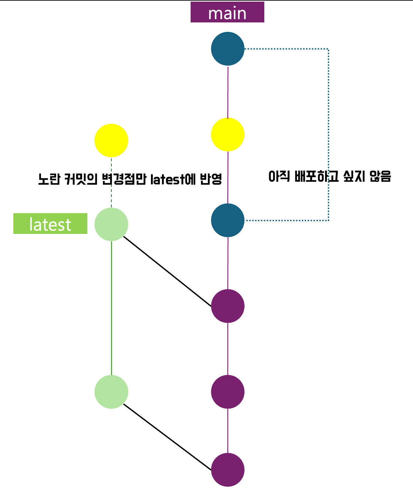

## Git 기본 내용
### 병합 커밋 vs 리베이스
- 상황 : main1의 브랜치 feat을 개발 완료 후 Merge 하려고 하는데, main1 -> main2 로 업데이트 되어 있음 
- 방법 1 : 병합 커밋
  - feat 브랜치 기준으로 main2를 pull 하여 merge 한다. (이때 merge 커밋이 생성된다.)
  - feat 브랜치에서 merge시 발생하는 충돌을 해결 한뒤, push 
  - main으로 체크아웃하고 feat을 Merge한다.
- 방법 2 : 리베이스
  - feat 브랜치의 베이스를 main1이 아닌 main2가 되도록 조작(리베이스)하는 것
  - 해당 방법은 커밋 히스토리가 재작성되므로 꼭 자신만의 브랜치에서만 사용. 이미 공유된 커밋을 리베이스 하면 안됨
  - 강제 푸쉬 후 pull reqest
- 어떤 방법이 좋은가?
    ```
    병합 커밋 (Merge Commit)을 사용하는 것이 좋은 경우:
    
    - 팀 협업: 여러 개발자가 동시에 작업하는 경우, 병합 커밋은 각 브랜치의 히스토리를 보존하여 누가 어떤 작업을 했는지 명확하게 볼 수 있습니다.
    - 복잡한 프로젝트: 프로젝트가 크고 복잡한 경우, 각 브랜치의 히스토리를 보존하는 것이 중요할 수 있습니다.
    - 충돌 빈번: 병합 과정에서 충돌이 빈번하게 발생하는 경우, 병합 커밋으로 충돌을 한 번에 해결하는 것이 더 편리할 수 있습니다.
    
    리베이스 (Rebase)를 사용하는 것이 좋은 경우:
    
    - 개인 작업: 개인이 작업한 브랜치를 메인 브랜치에 병합할 때, 히스토리를 깔끔하게 유지할 수 있습니다.
    - 간단한 프로젝트: 프로젝트가 비교적 간단하고 충돌이 적을 때, 리베이스를 통해 히스토리를 선형으로 유지할 수 있습니다.
    - 협업 초반: 작업이 메인 브랜치에 반영되기 전, 개인 브랜치에서 리베이스를 사용하면 히스토리가 깔끔하게 유지됩니다.
    ```
  - 결론 
    - 협업 시에는 병합 커밋을 사용하는 것이 더 일반적이며, 개인 작업이나 히스토리를 깔끔하게 유지하고 싶은 경우에는 리베이스를 사용

### 풀 리퀘스트 병합 전략 : 스쿼시 
- Git 스쿼시는 여러 개의 커밋을 하나로 합치는 작업이다.
- feat 기능 개발 커밋을 하나로 스쿼시해 main에 병합해 주면, main에는 feat 브랜치에 대한 내용이 구구절절 안 들어가고 한 줄로 간단해짐 
  - 브랜치 병합 시, `--squash` 옵션을 사용하면, 병합하는 브랜치의 모든 커밋을 하나의 커밋으로 합쳐서 병합할 수 있다.
  ```shell
  git checkout main # 1. 병합 대상 브랜치로 체크아웃
    
  git merge --squash feat-branch # 2. 병합하려는 브랜치를 스쿼시 하여 병합   
  
  git commit -m "Merge feat-branch" # 3. 스쿼시된 변경사항을 커밋 
  ```
### amend : 커밋 내용 수정
- 공통
  1. 수정할 파일 변경
  2. 변경된 파일 스테이징 (add)
  - 커밋 내용이 아닌 커밋 메시지만 수정하고 싶을 시, 해당 공통 단계 생략하면 됨 
- 로컬 커밋
  - `git commit --amend` : 마지막 커밋 수정 
  - `git rebase -i HEAD~n`  : n개의 마지막 커밋을 인터랙티브 모드로 수정
- 원격 커밋 
  1. `git commit --amend`
  2. `git push --force`
  - 협업 시에는 강제 푸시 대신 새로운 커밋을 추가하여 변경 사항을 변경하는 것을 추천

### revert, reset : 커밋 되돌리기
- revert 
  - 이전 버전으로 되돌아간 새로운 버전에 대한 커밋이 만들어짐 
  - 돌리고자 하는 버전에 head 되어 있는 상태에서 revert 
- reset
  - 되돌아갈 버전의 시점으로 완전히 돌아가고 해당 버전 이후는 삭제됨
  - 옵션
    - 커밋의 순서 : 작업 디렉토리에서 변경 사항 생성 -> 스테이지 올리기 -> 커밋하기 
    - soft : 작업 디렉터리 내 변경 사항과 스테이지에 추가된 변경 사항은 유지하되, 커밋했다는 사실만 되돌림 
    - mixed : 작업 디렉터리 내 변경 사항만 유지 
    - hard : 3단계 다 삭제 

### stash : 작업 임시 저장
- 작업 내역이 완전 맘에 들진 않지만 보관하고 싶을 때 사용 

### 체리픽 : 다른 브랜치의 커밋 하나만 내 브랜치에 반영 
- 상황 
  - 브랜치 전략은 `feat/` 에서 기능을 각자 개발하고, `main`에서 개발 완료된 코드를 합치고, `latest` 브랜치를 통해 배포 진행
  - 배포 후 latest 브랜치의 코드가 버그가 났다는 것을 인지하여 main에서 hotfix 브랜치를 따서 문제가 되는 부분만 고친 뒤, 병합 하길 원함
  
- main과 latest를 병합해야만 main에 병합될 hotfix 브랜치 내용이 반영 되는데, main에 병합 된 다른 기능 들이 latest에 병합되면 안된다. 
- 이런 상황에선, main에 hotfix를 병합한 커밋(체리)를 latest에서 체리픽하면 조건하에 버그를 고친 코드를 반영할 수 있다.

## git 브랜치 전략
1. git flow
  - main, develop, feature, release, hotfix 브랜티를 설정하고 운영하는 방식
  - 브랜치의 종류가 많다보니 러닝커브가 있는 편
2. github flow
  - main, feature 브랜치만으로 운영
  - 빠르게 개발해야하는 소규모 회사는 해당 방법을 이용하는 것이 좋음
- 전략시 고려할 수 있는 요소
  - 이 브랜치는 제품으로 내보낼 수 있는가
  - 이 브랜치는 빌드 실패를 허용하는가
  - 이 브랜치는 테스트 실패를 허용하는가
  - 이 브랜치는 임시로 운영하는가? 유지하지 않고 수시로 삭제하는가? 

