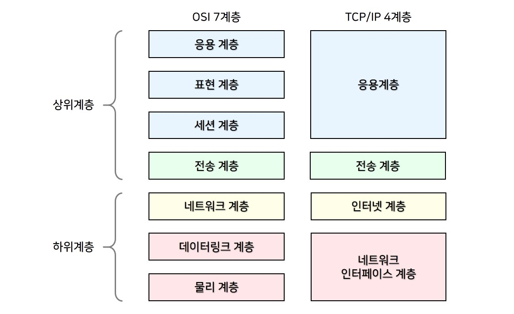

# 📒웹/HTTP/네트워크 - 임지영

## web
- 하이퍼텍스트 형식으로 작성된 문서 —> 웹  페이지 —(모여)—> 웹 사이트
    - 사용자가 하이퍼링크를 따라 다른 웹 페이지로 계속 이동하는게 웹 서핑

### TCP/IP 4계층, OSI 7계층
- 4 : client에서 서비스를 요청할 때 각 계층에서 어떤 프로토콜이 필요한 지 정의한 프로토콜 집합
- 7 : 네트워크 구성 요소의 표준화가 목적

### URL
- 포트 번호 : 입력 안 하면 각 프로토콜이 가진 기본 포트 번호 적용
    - Http : 80, Https : 443
- URIdentifier = URL + URN
    - URLocation : 책의 위치
    - URN : 책의 번호
### DNS
- www. goole. com
- 3차,    2차,    최상위 도메인
- DNS 서버 : IP 주소를 도메인으로 변환
    - 보통 한번 IP주소를 찾고 나면 로컬 DNS 서버에서 해당 도메인 정보를 임시로 저장하고,
    - 사용자의 PC에 전달, 다음부턴 미리 PC에 저장된 IP주소로 접근 가능

### IP
- 데이터를 작게 자른 패킷
    - 작게 잘라서 전송 도중 문제가 생겨도 다시 전송하기 위해 그 만큼의 data만 보내도 되게 함
    - 패킷 별로 최적의 경로 선택
- IP 주된 역할
    - 패킷을 목적지까지 전달(안내)
    - 외부에서 패킷이 들어오면 내 IP주소와 맞는지 비교, 아니면 다른 호스트로 전달
    - 패킷 손실, 중복과 같은 상태는 관할하지 않음 : 비신뢰성, 비연결성
    - 이는 TCP가 보조한다.
- 주소 구성
  - 네크워크 주소 : 같은 공유기를 사용하는 범위
  - 호스트 주소 : 이 네트워크에 연결된 각각의 장치
      - 0 : 네트워크 그 자체의 주소
      - 255 : 브로드 캐스트 : 모든 호스트에게 전달되어야 하는
  - 서브넷 마스크 : 네트워크/호스트 구분 역할 (1:네트워크, 0:호스트) 
- 네트웤, 호스트 비율 결정하는 기준
  - 클래스 기반 : A,B,C,D 클래스로 나뉘며 필요한 호스트 개수만큼 설정
  - CIDR : 네트워크/호스트 부분 구분점을 2진수의 한 자릿수 (1비트 단위)까지 가능하게 하여 유연성을 높임
  - DHCP (유동IP) : 
  - 사설 IP의 NAT(네트워크 주소 변환) : 집이나 회사 등 특정 네트워크별로 공유한 IP 주소를 하나씩 가져가되, 그 네트워크에 있는 호스트들은 따로 IP 가상화 

### TCP
- IP에 비해 헤더의 크기가 크다. (신뢰성, 연결성 통신)
  - 패킷이 순서대로 들어왔는지 패킷 번호 확인
  - 패킷 상태(플래스) 확인
- 헤더 구성(플래그)
  - ACK : 200 OK
  - SYN : 연결 요청
  - FIN : 연결해제 
  - 등 
- 연결 핸드 셰이크
  1. 클라 : SYN (연결 요청)
  2. 서버 : ACk + SYN (응답 및 연결요청)
  3. 클라 : ACK 응답
- 연결 해제 핸드 셰이크
  1. 클라 : FIN (FIN-WAIT)
  2. 서버 : ACK (CLOSE-WAIT)
  3. 서버 : FIN 
  4. 클라 : ACK (TIME-WAIT)
- 기능
  - 흐름제어 : 수신/송신 속도 제어
    - stop and wait : 매번 전송 패킷에 대해 확인, 응답이 오면 다시 전송
    - 슬라이딩 윈도 : 윈도 크기 정해서 한번에 그 크기만큼 전송, ACK에 몇번 패킷까지 처리했는지 응답 
  - 혼잡제어 (네트워크)
    - ACK 확인하여 전송에 비해 뒤의 번호를 처리하고 있으면 천천히 전송함

### UDP
- TCP와 비교
  - UDP : 비연결성, 순서보장 X, 혼잡제어 X

## HTTP
- 클라와 서버 사이의 소통을 담당
- 비상태성, 연결성
- 메시시 구조 : 헤더, 본문, 요청/응답 상태코드

### HTTP 무상태성을 보완하는 데이터 저장 방식
- 브라우저 쿠키
  - 클라이언트 기반 저장소
  - 클라, 서버 양쪽 접근 가능 
  - 매번 http header에 담겨 전송 
- HTML5 + Web Storage 
  - 쿠키보다 쉽고, 효율적 
  - 클라만 접근 가능, 서버 전송 x, 네트워크 통신 줄어듬
  - 로컬 스토리지
    - 의도적 삭제 안되면 데이터 유지
  - 세션 스토리지
    - 브라우저 종료시 삭제 
- IndexedDB 
  - 브라우저 내장 DB
  - 다양한 타입의 데이터 지원
  - js로 조작
- 세션
  - 서버에서 일시적으로 데이터 저장소로 기능 