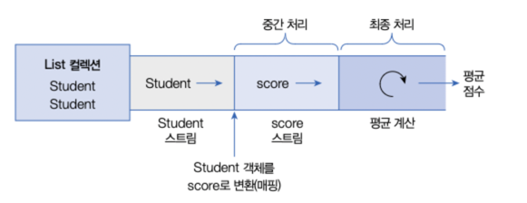
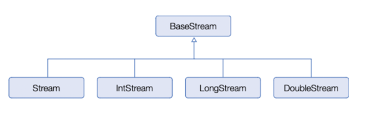
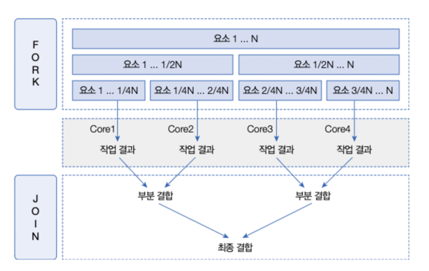

## 스트림이란
- 컬렉션 및 배열에 저장된 요소를 반복 처리 하기 위해 for문, iterator를 사용할 수 있지만 Stream을 통해 처리할 수도 있다.
- 스트림은 Java 8부터 사용할 수 있다. 
- ```
    Stream<String> stream = collection.stream();
    stream.forEach( item -> // item 처리 );
  ```

- 예제
  - ```java
    public static void main(String[] args) {
        List<String> list = new ArrayList<>();
        list.add("안녕");
        list.add("안녕1");
        list.add("안녕2");

        Stream<String> stringStream = list.stream();
        stringStream.forEach(item -> System.out.println(item + " "));
    }
    ```
- Stream과 Iterator 차이 
  1. 내부 반복자이므로 처리 속도가 빠르고 병렬 처리에 호율적이다.
  2. 람다식으로 다양한 요소 처리를 정의할 수 있다.
  3. 중간 처리와 최종 처리를 수행하도록 파이프 라인을 형성할 수 있다. 

### 1. 내부 반복자 
- 내부 반복자 : 요소 처리 방법을 컬렉션 내부로 주입시켜 요소를 반복 처리한다.
- 외부 반복자일 경우  **컬렉션의 요소를 외부로 가져오는 코드**와 **처리하는 코드**를 모두 개발자 코드가 가지고 있어야 한다.
- 개발자 코드에서 제공한 데이터 처리 코드 (람다식)을 가지고 컬렉션 내부에서 요소를 반복 처리한다.
- 멀티 코어 CPU를 최대한 활용하기 위해 요소들을 분배시켜 병렬 작업 가능 `parallelStream()`
- ```java
  Stream<String> stringStream = list.parallelStream();
        stringStream.forEach(item ->
                System.out.println(item + ": " + Thread.currentThread().getName())
        );
  ```
  ```
  안녕: ForkJoinPool.commonPool-worker-3
  안녕1: ForkJoinPool.commonPool-worker-1
  안녕3: ForkJoinPool.commonPool-worker-4
  안녕2: main
  안녕4: ForkJoinPool.commonPool-worker-2
  ```
- 그렇다면 내부반복자로 처리하면 왜 병렬로 처리할 수 있게 되는걸까
  - 외부반복자로도 병렬처리는 할 수 있지만, 개발자가 컬렉션의 반복을 직접 제어하므로 따로 스레드 관리 및 동기화 로직을 구현해 주어야 한다.
  - Stream에는 병렬 처리 로직이 추상화되어 있어 개발자가 직접 스레드를 관리할 필요가 없어졌다.
    ```
    병렬 처리 로직 코드 경로
    java.util.stream.AbstractPipeline: 스트림 파이프라인의 추상 기본 클래스
    java.util.stream.ReferencePipeline: 객체 스트림 파이프라인의 구현 클래스
    java.util.Spliterator: 병렬 처리를 위한 컬렉션 분할을 지원하는 인터페이스
    ```

### 2. 중간 처리와 최종 처리 
- 스트림은 하나 이상 연결될 수 있다. 스트림이 연결 되어 있는 것을 파이프라인이라고 한다. 
- 중간 스트림은 최종 처리를 위해 요소를 걸러내거나(필터링), 요소를 변환시키거나(매핑), 정렬하는 작업을 수행한다.
- 최종 처리는 중간처리에서 정제된 요소들을 반복하거나, 집계 작업을 수행한다. 파이프라인의 맨 끝에 최종 처리 부분이 없으면 오리지널 및 중간 처리 스트림은 동작하지 않는다.
- 사용 예 : Student라는 객체를 요소로 가지는 컬렉션에서 Student 스트림을 얻고, 중간 처리를 통해 score 스트림으로 변환한 후 최종 집계 처리로 score 평균을 구한다.
  -  
  - ```
    // Student 스트림
    Stream<Student> studentStream = studentList.stream();
    // score(int) 스트림
    IntStream scoreStream = studentStream.mapToInt( student -> student.getScore());
    // 평균 계산
    double avg = scoreStream.average().getAsDouble();
    
    // 위 코드를 간결히 나타내기
    double avg = studentList.stream()
        .mapToInt(student -> sutudent.getScore())
        .average()
        .getAsDouble();
    ```

### 리소스로부터 스트림 얻기
- `java.util.stream` 패키지에는 스트림 인터페이스들이 있다.
  - 
- `java.util.Collection` 인터페이스는 스트림과 `parallelStream()` 메서드를 가지고 있기 때문에 자식 인터페이스인 List, Set을 구현한 모든 컬렉션에서 객체 스트림을 얻을 수 있다. 
- IntStream, LongStream의 정적 메서드인 `range()`, `rangeClosed()` 를 이용하면 특정 범위의 정수 스트림을 얻을 수 있다.

### 요소 병렬 처리
- 자바는 요소 병렬 처리를 위해 병렬 스트림을 제공한다. 
- 병렬성은 데이터 / 작업 병렬성으로 구분 된다. 자바 병렬 스트림은 데이터 병렬성을 구현한 것이다.
  - 데이터 병렬성 : 전체 데이터를 분할해서 서브 데이터셋으로 만들고 이 서브 데이터셋들을 병렬 처리 해서 작업을 빨리 하는 것
  - 작업 병렬성 : 서로 다른 작업을 병렬 처리 하는 것. ex) 서버가 각각의 클라이언트에서 요청한 내용을 개별 스레드에서 병렬로 처리하는 것 
- 포크조인 프레임워크
  - 자바 병렬 스트림은 요소들을 병렬처리 하기 위해 포크조인 프레임워크를 사용한다.
  - 
  - 요소셋 수만큼 스레드를 생성하여 작업을 처리한다. 
- 병렬 스트림
  - 자바 병렬 스트림을 이용할 경우, 백그라운드에서 포크조인 프레임워크가 사용되기 때문에 개발자는 매우 쉽게 병렬 처리를 할 수 있다.
  - 관련 메서드 : collection - `parallelStream()` , XXStream - `parallel()`
- 병렬 처리 성능 3가지 요인
  1. 요소의 수와 요소당 처리 시간 : 요소의 수가 적고, 요소 당 처리 시간이 짧으면 일반 스트림이 병렬 스트림 보다 빠를 수 있다. 병렬처리는 포크 및 조인 단계가 있고, 스레드풀을 생성하는 추가적 비용이 있기 때문
  2. 스트림 소스의 종류 : ArraysList와 배열은 인덱스로 요소를 관리하기 때문에 포크 단계에서 요소를 쉽게 분리 할 수 있어 병렬 처리 시간이 절약된다. 반면에 HashSet, TreeSet, LinkedList는 요소 분리가 쉽지 않다.
  3. 코어의 수 : CPU 코어의 수가 적으면 일반 스트림이 더 빠를 수 있다. 병렬 스트림은 스레드 수가 증가하여 동시성이 많이 일어나므로 오히려 느려진다. 