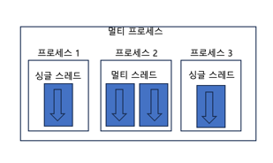

## 쓰레드
- 프로그램 실행의 가장 작은 단위
- Thread, Runnable 은 쓰레드를 위해 제공되는 기술이다.

### 멀티 스레드 개념
- 멀티 프로세스와 멀티 스레드

- 멀티 프로세스들은 독립적이하 하나의 프로세스에서 오류가 발생하여도 다른 프로세스에게 영향을 미치지 않는다.
- 하지만 멀티 스레드는 프로세스 내부에서 생성되기 때문에 하나의 스레드가 예외를 발생시키면 프로세스가 종료되므로 다른 스레드에게 영향을 미친다.
- 싱글 스레드에서는 메인 스레드가 종료되면 프로세스도 종료되지만
- 멀티 스레드에서는 작업중인 스레드가 하나라도 있다면 프로세스는 종료 되지 않는다. 메인 스레드가 작업 스레드보다 먼저 종료되어도 프로세스는 종료되지 않는다. 

### 쓰레드 생성
- 쓰레드 생성을 위해 클래스를 구현한다.
- `Runnable` 구현 객체를 매개값으로 갖는 생성자를 호출하고, `run()` 메소드 구현해야 한다.
  ```java
    // 쓰레드 클래스 생성
    class Task implements Runnable {
        @Override
        public void run() {
           // 스레드가 실행할 코드 
        }
    }
    // 생성자 호출 
    Thread th = new Thread(Runnable target);
    th.start()
    
  ```
  ```java
  // 익명 객체를 사용한 쓰레드 클래스 생성
  Thread th = new Thread(new Runnable() {
      @Override
      public void run() {}
  });
  ```
- Thread의 start 메소드를 호출하면 run 메소드가 실행된다. -> main 쓰레드가 아닌 별도의 쓰레드에서 실행된다. 
  ```java
     @Test
    void threadStart() {
        Thread thread = new MyThread();
    
        thread.start();
        System.out.println("Hello: " + Thread.currentThread().getName());
    }
    
    static class MyThread extends Thread {
       @Override
       public void run() {
           System.out.println("Thread: " + Thread.currentThread().getName());
      }
    }
    
    // 출력 결과
    // Hello: main
    // Thread: Thread-2

  ```
- Thread 자식 클래스로 생성 
  - 작업 스레드 객체를 생성하는 또 다른 방법은 Thread의 자식 객체로 만들고 run() 메서드를 재정의 하는 것이다.

### 쓰레드 상태
- 실행 대기 : 스레드 객체를 생성하고 `start()` 를 호출하면 곧바로 스레드가 실행되는 것이 아니라 실행 대기 상태 `RUNNABLE`이 된다.
- 실행 : 실행 대기하는 스레드는 CPU 스케줄링에 따라 CPU를 점유하고 run() 메서드를 실행한다. 이때를 실행 상태라고 한다. `RUNNING`
- 종료 : CPU 스케줄링에 따라 각 스레드가 실행 대기와 실행상태를 왔다갔다 하다가, run() 메서드가 종료되면 스레드의 실행이 멈춘다. `TERMINATED`
- 일시정지 : 스레드가 실행할 수 없는 상태일 때. 다시 실행 상태로 가려면 실행 대기 상태를 거쳐야 한다.

### 쓰레드 기본 내용
- 스레드 이름
  - 메인 : `main`
  - 작업 스레드 : `Thread-n`
  - Thread 클래스의 `setName("")`를 통해 임의로 지정할 수 있다.

- 메서드
  - currentThread() 
    - 정적 메서드  
    - 현재 코드를 어떤 스레드가 실행하고 있는지
  - getName()
    - 쓰레드의 이름 반환
  - sleep(long millis)
    - 현재 쓰레드 멈추기 (실행 -> 일시정지 --(일정시간 후)--> 실행 대기)
    - 자원을 놓아주지는 않고, 제어권을 넘겨주므로 데드락이 발생할 수 있다.
  - join()
    - 다른 쓰레드의 작업이 끝날 때 까지 기다리게 함 (실행 -> 일시정지)
    - join() 메서드를 가진 스레드가 종료 되면 실행 대기 상태가 된다. 
    - 다른 스레드가 종료될 때까지 기다렸다가 실행을 해야하는 경우 사용
  - wait()
    - 동기화 블록 내에서 실행 -> 일시 정지
  - interupt()
    - 일시 정지 상태일 경우 interruptedException 을 발생시켜 실행 대기 상태나 종료 상태로 만든다.
  - notify(), notifyAll()
    - wait() 메서드로 인해 일시 정지 상태인 스레드를 실행 대기 상태로 
  - yield()
    - 다른 스레드에게 실행 양보 : 실행 -> 실행 대기 상태
  - `wait`, `notify`, `notifyAll` 메서드는 Object의 메서드이다. 

### 쓰레드 동기화 
- 멀티 스레드는 하나의 객체를 공유해서 작업할 수도 있는데, 이때 값의 일관성을 신경써줘야 한다. (쓰기/읽기가 동시에 일어난다면?)
- 이를 위해 스레드가 사용 중인 객체를 다른 스레드가 변경할 수 없도록 스레드 작업이 끝날 때까지 객체에 잠금을 걸어준다. 이를 위해 자바는 동기화 메서드와 블록을 제공하낟.
- 객체 내부에서 동기화 메서드와 동기화 블럭이 여러 개가 있다면, 스레드가 이들 중 하나를 실행할 때 다른 스레드는 해당 메서드는 물론이고 다른 동기화 메소드 및 블럭도 실행할 수 없다.
- 동기화 메서드 및 블록 선언 : `synchronized` 키워드
  - `pulbic synchronized void method() { // 단 하나의 스레드만 실행하는 영역}` 
  - ```java
    // 동기화 블럭
    public void method() {
        // 여러 스레드가 실행할 수 있는 영역
    
        sychronized(공유객체) {
        // 단 하나의 스레드만 실행하는 영역 
      }
    
        // 여러 스레드가 실행할 수 있는 영역
    }
    ```
- wait(), notify()를 이용한 스레드 제어
  - 두 개의 스레드를 교대로 번갈아 가며 실행하고자 할 때, 정확한 교대 작업이 필요할 때 사용 
  - 자신의 작업이 끝나면 상대방 스레드를 일시 정지 상태에서 풀어주고, 자신은 일시 정지 상태로 만든다.

### 쓰레드 안전 종료
- 스레드는 자신의 run() 메서드가 모두 실행되면 자동적으로 종료되지만, 경우에 따라서 실행 중인 스레드를 즉시 종료할 필요가 있다.
- 이럴 땐 사용하던 리소스를 정리하고 run() 메서드를 빨리 종료 해야 한다. : 조건 이용 방법, interrupt() 이용

### 데몬 쓰레드
- 주 스레드의 작업을 돕는 보조적인 역할을 수행하는 스레드
- 주 스레드가 종료 되면 데몬 스레드도 같이 종료 된다. 
- 주 스레드가 데몬이 될 스레드의 setDaemon(ture)를 호출하면 스레드를 데몬으로 만들 수 있다.
  ```java
  // main 스레드의 데몬 스레드로 thread 생성 
  public static void main(String[] args) {
    Thread thread = new Thread();
    thread.setDaemon(ture);
    thread.start();
  }
  ```

### 쓰레드 로컬
- 쓰레드별 따로 사용되는 저장소라고 생각
- 싱글톤 환경에서 공용 필드를 쓸 때 동시성 문제가 발생하는 경우를 대비하여 사용가능
- 주의점으로는 쓰레드 풀을 같이 사용하는 환경에선 작업이 끝난 후에 꼭 쓰레드로컬을 remove() 해주어 다음 요청에서 재활용되지 않게 해야한다. 