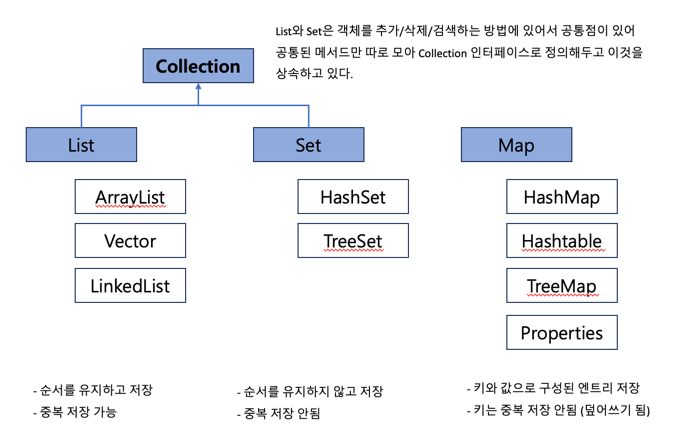
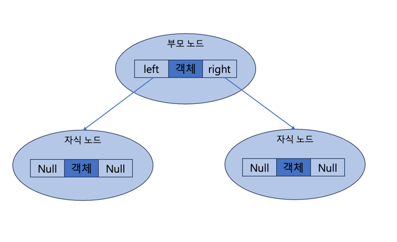

## 컬렉션 프레임워크
- 자바는 널리 알려져 있는 자료구조를 바탕으로 객체들을 효율적으로 추가,삭제,검색할 수 있도록 관련된 인터페이스와 클래스들을 `java.util` 패키지에 포함시켜 놓았다.
- 이를 총칭해서 컬렉션 프레임워크라고 부른다.
- 주요 인터페이스는 List, Set, Map이며 이를 통해 다양한 컬렉션 클래스를 이용할 수 있도록 설계되어 있다.
- 

### List 컬렉션
- 주요 메서드
  - 추가 `add` 검색 `get` `contains` `isEmpty` `size` 삭제 `remove` `clear`
- ArrayList
  - 일반 배열과 달리 객체를 제한 없이 추가할 수 있다는 장점을 가짐
  - 컬렉션에 객체를 추가하면 인덱스 0번부터 차레대로 저장
  - 특정 인덱스의 객체를 제거하면 바로 뒤 인덱스부터 마지막 인덱스까지 모두 앞으로 1씩 당겨진다. (추가 시에도 동일)
  - 따라서 빈번한 삽입/삭제가 일어나는 곳에서는 바람직한 자료구조가 아니다. -> Linked List
- Vector 
  - ArrayList와 동일한 내부 구조를 가진다. 차이점은 Vector은 동기화된 메서드로 이루어져 있다. 
  - 따라서 여러 스레드가 동시에 add 같은 메서드를 호출할 수 없어 경합이 발생하지 않아 안전하다.
- LinkedList
  - ArrayList와 사용 방법이 동일하지만 내부 구조가 다르다.
  - 인접 객체를 체인처럼 연결해서 관리하며 
  - 특정 위치에서 객체 삽입/제거 시 바로 앞 뒤 링크만 변경하면 된다.

### Set 컬렉션
- 기본 메서드는 List 컬렉션과 같다 (index가 매개변수 인 것은 없음)
### HashSet
- Set은 동일한 객체를 중복 저장하지 않는데, 여기서 동일한 객체는 동등 객체 이다.
  - 다른 객체(인스턴스)라도 `hashCode()` 메소드의 리턴값이 같고, `equals()` 리턴이 ture라면 동일한 객체라고 판단한다. 
  - 해당 메서드들을 재정의 하여 동등객체를 개발자나 도메인에 맞게 중복에 대해 정의할 수 있다.
- Set 컬렉션 모든 원소 출력
  - for문 이용 or `iterator()`로 반복자 얻어 객체 하나씩 가져온다.
  ```java
  // iterator 사용 방법
  Set<E> set = new HashSet<>();
  Iterator<E> iterator = set.itrator();
  
  while(iterator.hasNext()) {
    E e = iterator.next();
    iterator.remove(); // 현재 가져온 객체를 컬렉션에서 제거 
  }
  ```

## Map 컬렉션
- 주요 메서드
  - 추가 `V put(K key, V value)` 
  - 검색
    - `boolean containsKey(O key)` : 주어진 키가 있는지 
    - `boolean containsValue(O value)` : 주어진 값이 있는지
    - `Set<Map.Entry<K,V>> entrySet()` : 키와 값의 쌍으로 구성된 모든 Map.Entry 객체를 Set에 담아 리턴
    - `V get(O key)` : 주어진 키의 값을 리턴
    - `Set<K> keySet()` : 모든 키를 Set 객체에 담아 리턴
    - `Collection<V> values()` : 모든 값을 Collention에 담아 리턴
    - `int size()` : 저장된 키의 총 수를 리턴 
### HashMap
- 키로 사용할 객체가 `hashCode()` 메소드의 리턴 값이 같고 and `equals()`가 true를 리턴할 경우 동일 키로 보고 중복 저장을 허용하지 않는다.
- 중복 키로 삽입되면, 제일 마지막에 삽입된 값만 저장한다. 
### Hashtable
- HashMap과 동일한 내부 구조를 가지지만 동기화 메소드로 구성되어 있어 멀티 스레드 환경에서 안전하게 사용 가능하다.
### Properties
- Hashtable의 자식 클래스이며, 키와 값을 String 타입으로 제한한 컬렉션이다.
- 주로 .properties 인 프로퍼티 파일을 읽을 때 사용한다.

## 검색 기능을 강화시킨 컬렉션 : Tree~
### TreeSet
- 이진 트리를 기반으로 한 Set 컬렉션 
- 부모 노드의 객체와 비교해서 낮은 것은 왼쪽 자식 노드에, 높은 것은 오른쪽 자식 노드에 저장한다.

```java
    public static void main(String[] args) {
        TreeSet<Integer> scores = new TreeSet<>();
        for(int i=30; i<100; i+=10) {
            scores.add(i);
        }
        forPrint(scores);

        System.out.println("======= 특정 객체 검색 ======");
        System.out.println("가장 낮은 점수 : " + scores.first());
        System.out.println("가장 높은 점수 : " + scores.last());
        System.out.println("80점 아래 점수 : " + scores.lower(80));
        System.out.println("80점 위 점수 : " + scores.higher(80));
        System.out.println("80점 아래 점수 : " + scores.lower(80));
        System.out.println("85점이거나 바로 아래 점수 : " + scores.floor(85));
        System.out.println("85점이거나 바로 위 점수 : " + scores.ceiling(85));

        System.out.println("======= 내림차순 정렬 ======");
        NavigableSet<Integer> descendingScores = scores.descendingSet();
        forPrint(descendingScores);

        System.out.println("======== 범위 검색 ( 70 <= ) ======== ");
        NavigableSet<Integer> rangeSet = scores.tailSet(70,true);
        forPrint(rangeSet);

        System.out.println("======== 범위 검색 ( 40 <= score < 90 ) ======== ");
        rangeSet = scores.subSet(40, true, 90, false);
        forPrint(rangeSet);
    }
    private static <T> void forPrint(Collection<T> sets) {
        for(T t : sets) {
            System.out.print(t + " ");
        }
        System.out.println();
    }
}
```

### TreeMap
- 키와 값이 저장된 Entry를 저장한다. 
- TreeMap에 엔트리를 저장하면 키를 기준으로 자동 정렬된다. 

### Comparable과 Comparator
- TreeSet에 저장되는 객체와 TreeMap에 저장되는 키 객체는 저장과 동시에 오름차순으로 정렬 된다.
  - 어떤 객체든 정렬될 수 있는 것은 아니고 객체가 Comparable 인터페이스를 구현하고 있어야 가능하다. 
  - Comparable 인터페이스에는 `compareTo(T o)` 가 정의되어 있고 이 메서드 재정의를 통해 비교 결과를 정수 값으로 리턴해야 한다.
    ```
    0 : 주어진 객체와 같다.
    음수(-1) : 주어진 객체보다 작다
    양수(1) : 주어진 객체보다 크다
    ```
- 비교 대상 객체가 Comparable을 구현하게 하는 방법 `compareTo(T o1)`
```java
public class ComparableExample {
    public static void main(String[] args) {
        TreeSet<Person> treeSet = new TreeSet<>();
        treeSet.add(new Person("최원규",60));
        treeSet.add(new Person("최수정", 26));
        treeSet.add(new Person("최인정", 29));
        for(Person person : treeSet) {
            System.out.println(person.name + " : " + person.age);
        }
    }
}

class Person implements Comparable<Person> {
    String name;
    int age;

    public Person(String name, int age) {
        this.name = name;
        this.age = age;
    }
    @Override
    public int compareTo(Person o) {
        if (this.age < o.age) return -1;
        else if(this.age > o.age) return 1;
        else return 0;
    }
}
```
- 비교 대상 클래스를 수정하지 않고 따로 Comparator (비교자)객체를 만들어서 정렬 `compare(T o1, T o2)`
```java
public class TreeComparatorExample {
    public static void main(String[] args) {
        // 비교자를 의존한 TreeSet 컬렉션 생성
        TreeSet<Fruit> treeSet = new TreeSet<>(new FruitComparator());

        treeSet.add(new Fruit("귤", 10_000));
        treeSet.add(new Fruit("사과", 20_000));
        treeSet.add(new Fruit("수박", 15_000));

        for(Fruit fruit : treeSet) {
            System.out.println(fruit.name + " : " + fruit.price);
        }
    }
}

class Fruit {
    String name;
    int price;

    public Fruit(String name, int price) {
        this.name = name;
        this.price = price;
    }
}

class FruitComparator implements Comparator<Fruit> {
    @Override
    public int compare(Fruit o1, Fruit o2) {
        if(o1.price < o2.price) return -1;
        else if(o1.price == o2.price) return 0;
        else return 1;
    }
}
```

## LIFO(후입선출) 스택,  FIFO(선입선출) 큐
### Stack
- `Stack<T> stack = new Stack<>();`
- 주요 메서드 
  - 삽입 `push(E item)`, 삭제 `pop()`

### Queue
- `Queue<E> queue = new LinkedList<>();`
- 주요 메서드
  - 삽입 `offer(E item)`, 삭제 `poll()`

## 기타 내용
### 동기화된 컬렉션 
- Vector, Hashtable을 제외한 컬렉션은 싱글 스레드 환경에 적합하도록 설계되었다.
- 비동기화된 메소드를 동기화된 메소드로 래핑하는 `Collections`의 `synchronizedXXX()`로 보완하자.

### 수정할 수 없는 컬렉션
- 요소를 추가, 삭제할 수 없는 컬렉션을 말한다.
- List,Map,Set 인터페이스의 정적 메소드인 `of()`로 생성
  ```java
  List<E> immutableList = List.of(E... elements);
  ```
- List, Set, Map 인터페이스의 정적 메서드인 `copyOf()` 이용하여 기존 컬렉션을 복사하여 수정할 수 없는 컬렉션 생성