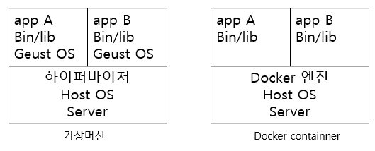
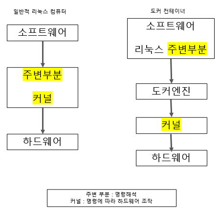
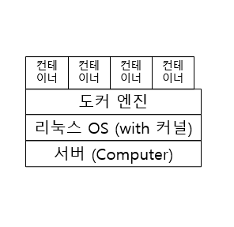

- 터미널과 aws에 띄운 linuxServer 연결하는 명령어 
  - chmod 400 linuxServerKey.pem
  - ssh -i "linuxServerKey.pem" ubuntu@ec2-43-202-47-62.ap-northeast-2.compute.amazonaws.com

## Docker 
### 개념 
- 서버란?
  - 어떤 기능을 해주는 제공처라고 생각하면 됨.
  - 웹 기능을 제공하면 웹 서버 라고 지칭하는 것처럼 해당 소프트웨어를 설치하면 서버의 기능을 갖게 된다고 생각 
- 컨테이너 
  - 여러 개의 서버를 물리적 서버 한 대에 띄울 수 있게 하는 기술
  - 물리 서버를 줄 일 수 있고
  - 설정을 옮기는 것으로 컨테이너를 이동시켜 쉽게 이식할 수 있어 환경 차이로 인한 문제를 원천적으로 방어 가능
    - 도커 엔진만 있으면 다른 물리 서버에서도 컨테이너가 동일하게 동작한다.
- Docker
  - 컨테이너 기술을 구현할 수 있는 기술
  - 실행환경을 분리시킬 수 있다는 것이 장점의 시작점이다.
  - vs 가상화기술
    - 가상화기술은 물리적 부품을 소프트웨어로 구현하는 기술 
    - 하이퍼 바이저를 통하기 때문에 일반 호스트보다 성능의 손실이 발생한다.
    - 또한 게스트 운영체제를 사용하기 위해 라이브러리, 커널 등을 전부 포함해야 한다. (docker로 따지면 이미지의 크기를 키우는 꼴)
    - 도커 컨테이너는 컨테이너에 필요한 커널을 호스트 커널을 통해 공유하고 
    - 컨테이너 안에는 애플리케이션을 구동하는데 필요한 라이브러리, 실행 파일만 존재한다. 
    - 

### 구조
- 컨테이너 속에 리눅스 운영체제 비슷한 무언가가 들어 있다 !
- 
- 이러한 구조를 가졌기 때문에 호스트 커널을 공유하여 성능을 더 높일 수 있다.
- docker는 기본적으로 리눅스용 소프트웨어이기 때문에, 호스트 커널은 리눅스이고, 컨테이너에 쓰일 소프트웨어 또한 리눅스용이여야 사용 가능
- 통상적으로 한 컨테이너에 하나의 프로그램을 배치한다. 
- 

### 동작원리  
- 도커 데몬
  - 도커엔진은 외부로부터 API 입력을 받아 도커 엔진의 기능을 수행 
  - 도커 프로세스가 실행되어 서버로써 입력을 받을 준비가 된 상태를 도커 데몬이라 한다.
- 도커 클라이언트
  - 이 API를 이용할 수 있도록 CLI를 제공하는 것
  - 사용자가 docker 명령어를 입력하면 도커 클라이언트를 사용하는 것
  - 도커 클라이언트는 /var/run/docker.sock 에 위치한 유닉스 소켓을 통해 도커 데몬의 API를 호출한다.
- 우분투에선 도커가 설치되면 자동으로 서비스로 등록되므로 호스트가 재시작 되더라도 자동으로 실행된다. 
  - 수동 시작/중지
    ```
    service docker start
    service docker stop 
    ```

## 명령어 정리 (상위 커맨드 별)
docker {상위 command} {하위 command} {option} {대상} {인자} 
### 컨테이너 container
| 하위 커맨드 | 내용                                                         | 주요 옵션                |
| ----------- | ------------------------------------------------------------ | ------------------------ |
| start       | 컨테이너 실행                                                | -i                       |
| stop        | 컨테이너 정지                                                |                          |
| create      | 도커 이미지로부터 컨테이너 생성                              | --name -e -p -v          |
| run         | 도커 이미지 내려 받고, 컨테이너 생성, 실행<br /> `docker image pull`, `docker container create`, `docker comtainer start` 가 합쳐진 명령어 | --name -e -p -v -d -i -t |
| rm          | 정지 상태의 컨테이너 삭제                                    | -f -v                    |
| exec        | 실행 중인 컨테이너 속에서 프로그램을 실행                    | -i -t                    |
| ls          | 컨테이너 목록 출력                                           | -a                       |
| cp          | 도커 컨테이너와 도커 호스트 간에 파일을 복사                 |                          |
| commit      | 도커 컨테이너를 이미지로 변환                                |                          |

### 이미지 image
| 하위 커맨드 | 내용                                            | 주요 옵션 |
| ----------- | ----------------------------------------------- | --------- |
| pull        | 도커 허브 등의 리포지토리에서 이미지를 내려받음 |           |
| rm          | 도커 이미지 삭제                                |           |
| Is          | 내려 받은 이미지 목록을 출력                    |           |
| build       | 도커 이미지 생성                                | -t        |

### 볼륨 volume
| 하위 커맨드 | 내용                                  | 주요 옵션 |
| ----------- | ------------------------------------- | --------- |
| create      | 볼륨을 생성                           | --name    |
| inspect     | 볼륨의 상세 정보를 출력               |           |
| ls          | 볼륨의 목록을 출력                    | -a        |
| prune       | 현재 마운트되지 않은 볼륨을 모두 삭제 |           |
| rm          | 지정한 볼륨을 삭제                    |           |

### 네트워크 network
- 도커 네트워크 : 도커 요소 간의 통신에 사용하는 가상 네트워크 

| 하위 커맨드 | 내용                                               | 주요 옵션 |
| ----------- | -------------------------------------------------- | --------- |
| connect     | 컨테이너를 도커 네트워크에 연결                    |           |
| disconnect  | 컨테이너의 도커 네트워크를 연결을 해제             |           |
| create      | 도커 네트워크 생성                                 |           |
| inspect     | 도커 네트워크 상세 정보 출력                       |           |
| ls          | 도커 네트워크의 목록을 출력                        |           |
| prune       | 현재 컨테이너가 접속하지 않은 네트워크를 모두 삭제 |           |
| rm          | 지정한 네트워크를 삭제                             |           |

### 단독 
- 주로 도커 허브의 검색이나 로그인에 사용 

---
## 컨테이너의 통신
- 아파치가 동작 중인 서버에 파일을 두면 이 파일을 웹 사이트 형태로 볼 수 있다.
- 컨테이너를 실행 중인 물리적 컴퓨터가 외부의 접근을 대신 받아 컨테이너에 전달하여 통신한다
  - `-p 8080:80`
  - 컴퓨터 (호스트)의 8080 포트를 컨테이너(아파치)의 80 포트와 연결한다.
  - 같은 웹 서버(컨테이너)를 함께 실행하는 경우, 호스트 번호를 모두 같은 것으로 사용하면 어떤 컨테이너로 가야 하는지 모르기 때문에 포트 번호를 겹치지 않게 연결해야 한다.
  - 만약 같은 포트로 해야 한다면, 리버스 프록시로 서버 이름을 통해 구별하도록 구성한다. 

## 볼륨 마운트
- 컨테이너의 일부를 호스트 컴퓨터의 일부와 같이 다룰 수 있는 기능 
  - 볼륨 : 스토리지의 한 영역을 분할한 것
  - 마운트 : 연결하다, 대상을 연결해 운영체제 또는 소프트웨어의 관리하에 두는 일
- 데이터 퍼시스턴시 : 컨테이너는 생성 및 폐기가 빈번하므로 매번 데이터를 옮기는 대신 처음부터 컨테이너 외부에 둔 데이터에 접근해 사용하는 것이 일반적이다. 이때 데이터를 두는 장소가 마운트된 스토리지 영역이다.
- 스토리지 마운트 종류 : 볼륨 마운트, 바인드 마운트
  - 볼륨 마운트 
    - 도커 엔진이 관리하는 영역 내에 만들어진 볼륨을 컨테이너에 디스크 형태로 마운트 
    - 이름으로 관리가 가능하여 다루기 쉽지만 볼륨에 비해 직접 조작하기 어려워
    - 임시 목적이나 자주 쓰지는 않지만 지우면 안 되는 파일을 두는 목적으로 많이 사용한다.
  - 바인드 마운트
    - 도커가 설치된 컴퓨터의 문서 폴더 또는 바탕화면 폴더 등 도커 엔진에서 관리하지 않는 영역의 기존 디렉터리를 컨테이너에 마운트하는 방식 
    - 자주 사용하는 파일을 두는데 사용한다.
- 구현
  1. 볼륨 생성 : `docker volume create {name}`
  2. 스토리지 마운트 : `docker {컨테이너 생성 명령} -v {볼륨 이름}:{컨테이너 마운트 경로}`
  3. 볼륨 상세 정보, 컨테이너에 마운트 됐는지 확인 : `docker volume inspect {볼륨 이름}`

## 컨테이너로 이미지 생성
- 방법 2가지 
  - commit 커맨드 : 기존에 만들어 둔 컨테이너가 있을 때 사용하면 편리 
    - `docker commit {컨테이너 이름} {새로운 이미지 이름}`
  - Dockerfile 스크립트 : 실제 컨테이너 만들 필요 없음
    - `docker build -t {생성할 이미지 이름} {스크립트 경로}`
- 이미지 옮기는 방법
  - 컨테이너는 먼저 이미지로 변환하지 않으면 옮기거나 복사할 수 없음
  - 이미지도 이미지 상태 그대로는 옮기거나 복사할 수 없다.
  - 도커 레지스트리를 이용하거나
  - `save` 커맨드를 통해 `tar`포맷으로 도커 엔진의 관리 영역 바깥으로 내보내야 한다.
    - `docker save -o {파일 이름.tar} {이미지 이름}`
  - 파일은 호스트 컴퓨터의 파일 시스템에 생성된다.
    - 파일을 다시 도커 엔진에 가져오려면 `load` 커맨드를 사용한다.

### Dockerfile 명령어
| 명령       | 내용                                                         |
| ---------- | ------------------------------------------------------------ |
| from       | 토대가 되는 이미지를 지정                                    |
| add        | 이미지에 파일이나 폴더를 추가                                |
| copy       | 이미지에 파일이나 폴더를 추가                                |
| run        | 이미지를 빌드할 때 실행할 명령어를 지정                      |
| cmd        | 컨테이너를 실행할 때 실행할 명령어 지정                      |
| entrypoint | 컨테이너를 실행할 때 실행할 명령어 강제 지정                 |
| onbuild    | 이 이미지를 기반으로 다른 이미지를 빌드할 때 실행할 명령어를 지정 |
| expose     | 이미지가 통신에 사용할 포트를 명시적으로 지정                |
| volume     | 퍼시스턴시 데이터를 저장한 경로를 명시적으로 지정            |
| env        | 환경변수를 정의                                              |
| workdir    | 명령어를 실행하는 작업 디렉터리 지정                         |
| shell      | 빌드 시 사용할 셰을 변경                                     |
| label      | 이름이나 버전, 저작자 정보를 설정                            |

## Docker Compose 
- 도커 설정을 기재한 설정 파일을 이용해, 한 번에 여러 컨테이너를 생성, 실행, 폐기하는 기능 제공
### 사용 방법
1. 파이썬 런타임과 도커 컴포즈 설치
   ```shell
    sudo apt install -y python3-pip
    sudo pip3 install docker-compose
   ```
### docker-compose.yml 작성
- 주 항목 -> 이름 추가 -> 설정 순으로 작성한다고 생각
  - 주 항목 : services(컨테이너 모음), networks, volumes
  - 정의 내용 : image, ports, networks, volumes, environment, depends_on, restart
```
version: "3"
services:
  컨테이너_이름1:
  컨테이너_이름2:
networks:
volumes:
```
- 주의점
  - YAML 형식은 공백의 개수에 따라 의미가 달라짐 like python
    - tab 사용불가
  - 이름 뒤에는 콜론(:)을 꼭 붙일 것.
  - 이어서 설정을 기재하려면 콜론 뒤에 공백이 하나 있어야 한다.
    - 설정 사항이 여러 개라면 줄을 바꿔 하이픈(-)을 앞에 적고 들여쓰기를 맞춘다.
    - 이 말은 즉슨, 앞에서 이름을 적을 때 들여쓰기 한 단을 '공백 두개'로 했다면 '공백 두개'를 더 들여써야 한다.
  - #은 주석, 문자열은 '', "" 감싸기 

## 문제상황과 해결방법
- aws 서버에 ssh를 터미널에 띄어 연결하려고 했는데 연결이 되지 않았다.
  - aws 서버 재부팅을 하고서 연결 했더니 되더라.
- ec2 인스턴스를 통해 서버를 구축하고 있어. 인스턴스를 재부팅했는데도 이전에 설치한 docker가 내부에 남아 있어. 재부팅 하면 내역이 사라질 줄 알았는데 왜 남아있는거야
  - ec2의 특성 
    - EC2 인스턴스는 기본적으로 EBS(Elastic Block Store) 볼륨을 사용
    - 재부팅은 인스턴스를 껐다 켜는 것과 유사한 동작으로, 인스턴스의 메모리와 CPU를 초기화하지만, EBS 볼륨에 저장된 데이터는 그대로 남아 있습니다.
  - 결론 : EC2 인스턴스의 EBS 볼륨은 기본적으로 데이터를 지속시키기 때문에 재부팅해도 Docker와 같은 설치된 소프트웨어가 그대로 남아 있습니다. 인스턴스를 매번 초기화된 상태로 사용하고 싶다면 인스턴스 설정과 스토리지 옵션을 조정해야 합니다.
  - 만약 인스턴스를 종료하면서 데이터도 삭제하고 싶다면, "Delete on Termination" 옵션을 사용해야 합니다. 이 경우 인스턴스를 종료할 때 EBS 볼륨도 삭제되어 데이터가 사라집니다.
- apt 명령어를 실행하는데 `E: dpkg was interrupted, you must manually run 'sudo dpkg --configure -a' to correct the problem.` 에러 발생
  - 리눅스 패키지 작업에 대한 이해가 필요함 : https://bradbury.tistory.com/227
  - aws를 재부팅 하면서, 작업 중 중단이 생겨 에러가 발생 메뉴얼 대로 'sudo dpkg --configure -a'를 먼저 실행시켜 해결 가능


## 참고 사이트
- aws : https://bcp0109.tistory.com/356
- docker 명령어 : https://docs.docker.com/reference/