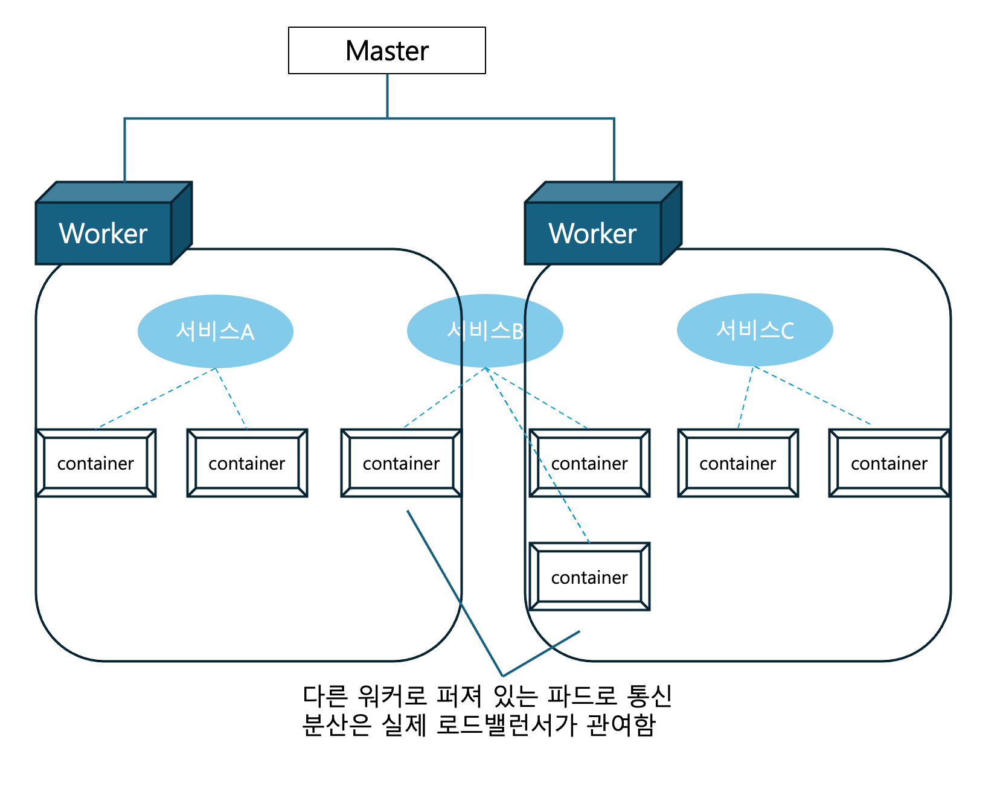

# 쿠버네티스
- 컨테이너 오케스트레이션 도구의 일종 : 시스템 전체를 통괄하고 여러 개의 컨테이너를 관리하는 일 
- 여러 대의 컨테이너가 **여러 대의 물리적 서버에 걸쳐** 실행되는 것을 전제로 한다.
- 도커 컴포즈와 쿠버네티스 차이점
  - 물리적 서버의 갯수 차이 : 도커 컴포즈를 사용한다 해도 물리적 서버가 여러 대라면 반복 작업은 사라지지 않는다.
  - 도커 컴포즈 - 컨테이너를 생성/삭제만 한다. "만들고 나면 끝"
  - 쿠버네티스 - 생성/모니터링/유지/삭제 한다. "항상 바람직한 상태를 유지"
    - 망가지면 삭제하고, 새 컨테이너로 대체한다. YAML에 컨테이너 개수를 수정하면, 해당 개수에 맞춰 알아서 삭제 및 생성한다.
- 서버 한 대로도 쿠버네티스가 필요한 이유
  - 시스템을 쿠버네티스에서 동작하는 형태로 만들면, 설정정보를 함께 배포할 수 있어 설치 후 설정이 간단하다.
- 로드밸런서, 클라우드 컴퓨팅, 쿠버네티스
  - 로드밸런서 : 여러 대의 서버를 갖추고 요청을 각 서버에 분산시킨다.
  - 로드밸런서를 사용해도 요청이 많을 때에 맞춰 놓은 서버는 요청이 적을 땐 놀게 되는 문제점이 발생한다.
  - 부하에 맞춰 컨테이너(서버)를 늘리고 줄이는 것을 도커&쿠버네티스와 클라우드 컴퓨팅이 가능하게 한다.

## 클러스터
- 마스터 노드와 워커 노드로 구성된 일군의 쿠버네티스 시스템을 이르는 말 
  - 노드는 물리적 서버와 일치하는 개념이라 생각
- 클러스터는 사람이 개입하지 않아도 마스터 노드에 설정된 내용에 따라 워커 노드가 관리되며 자율적으로 동작한다.

### 마스터 노드와 워커 노드
- 마스터 노드 
  - 전체적인 제어 담당
  - 워커 노드에서 실행되는 **컨테이너를 관리** 
  - 도커 엔진 같은 컨테이너 엔진도 설치되지 않는다.
- 워커 노드
  - 실제 동작을 담당
  - **컨테이너가 실제 동작하는 서버** 
  - **컨테이너 엔진**이 설치 되어 있다.
  - 관리자가 직접 워커 노드를 관리하지 않음 

## 쿠네버티스 리소스
- 파드, 서비스, 디플로이먼트, 레플리카 세트 외 다양한 리소스가 존재 한다.

### 파드
- 컨테이너 + 볼륨 or 컨테이너 모음
### 서비스
- 파드의 모음, 여러개의 파드를 이끄는 반장이라고 생각
- 파드가 여러 개의 워커 노드(물리적 서버)에 걸쳐 동작하더라도 이들을 모두 관리한다.
- 역할은 쉽게 말해 로드 밸런서이다. 각 서비스는 자동적으로 고정된 IP 주소를 부여 받으며 (cluster IP), 이 주소로 들어오는 통신을 처리한다. 
- 내부적으로는 여러개의 파드가 있어도, 외부에서는 이 cluster IP만 볼 수 있다. 
- 이 주소로 접근하면 통신을 적절히 분배 해 주는 구조이다. 
- 서비스가 분배하는 통신은 한 워커 노드 안으로 국한된다. 여러 노드 간의 분배는 실제 로드밸런서 또는 인그레스가 담당하며 이는 마스터 / 워커 노드 무엇도 아닌 별도의 노드에서 동작하거나 물리적 전용 하드웨어이다.
  - 인그레스 : 응용계층에서 동작하는 리버스 프록시 
- 
### 레플리카 세트
- 서비스가 요청을 배분하는 반장이라면, 레플리카 세트는 파드의 수를 관리한다. 
- 장애 등의 이유로 파드가 종료 됐을 때, 파드를 보충하거나 줄인다
- 레플리카 - 레플리카 세트가 관리하는 동일한 구성의 파드
### 디플로이먼트 
- 파드의 배포를 관리
- 파드가 사용하는 이미지 등 파드에 대한 정보를 가진다.
- 레플리카 세트보다 위에 있는 상사st 

## 사용방법
- 일반적으로 클라우드 컴퓨팅 서비스를 이용해 구축하는 경우가 많다. (쿠버네티스 구축 어려워서)
- AWS에서는 EC2나 Faragate를 워커 노드로 사용하고, EKS(Elastic Kubernetes Service)를 사용해 관리한다. EKS를 마스터 노드라고 생각 
- 매니페스트 파일(.yaml, json)을 작성해 설정정보(리소스별 자세한 항목)를 적고, 이를 etcd에 등록하면 된다. 
### 설치
- 마스터, 워커에 다 설치 할 것
  - 쿠버네티스 소프트웨어
  - CNI (가상 네트워크 드라이버) : 플란넬, 칼리코, AWS VPC CNI
- 마스터용
  - etcd (database) : 마스터 노드에서 컨테이너 등의 상태를 관리하기 위한 데이터베이스 
- 워커용
  - containner Engine : like docker Engine
- 관리자 컴퓨터
  - kubectl : 마스터 노드에 로그인해 초기 설정을 진행하거나 추후 조정하기 위한 소프트웨어 

