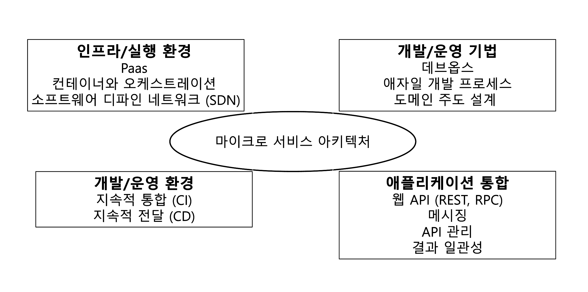
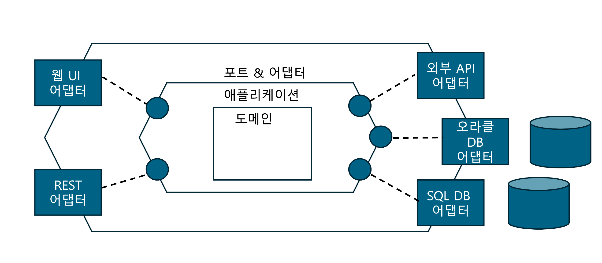
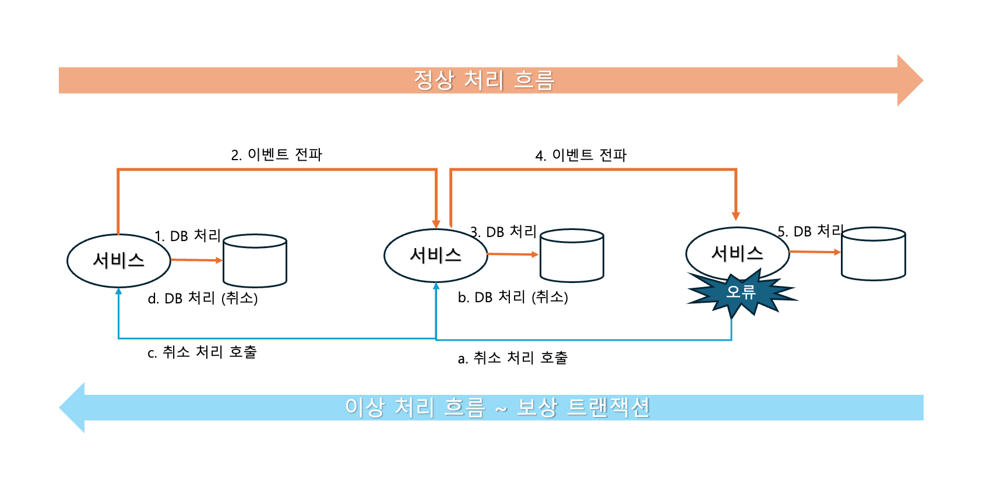
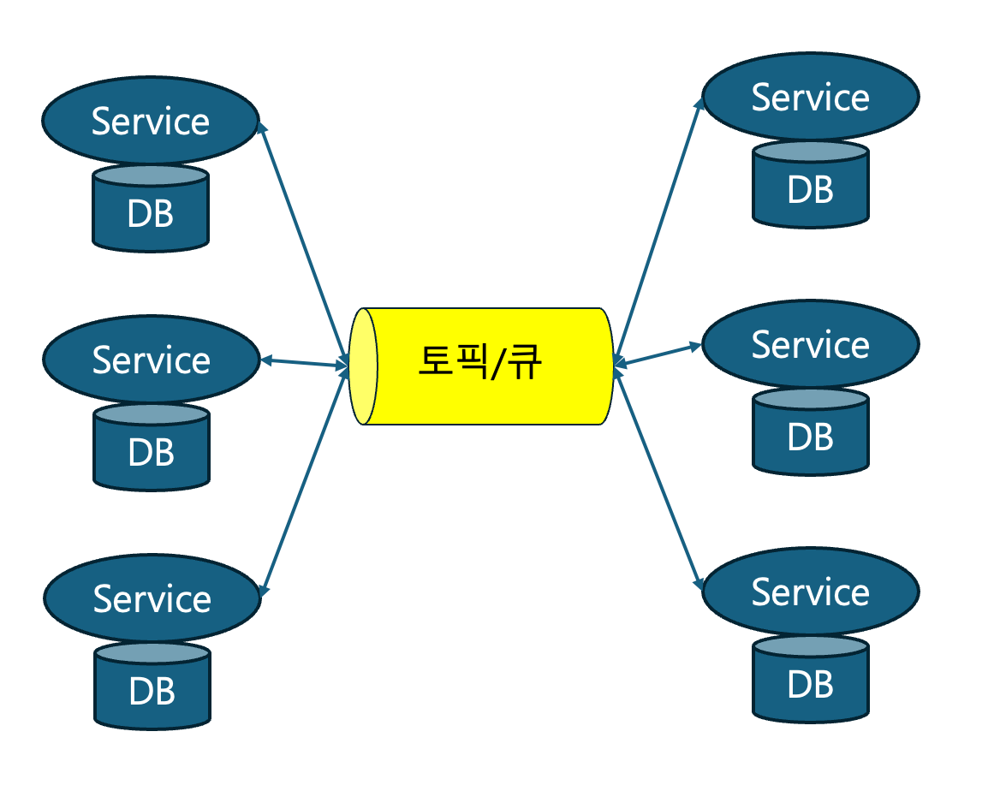
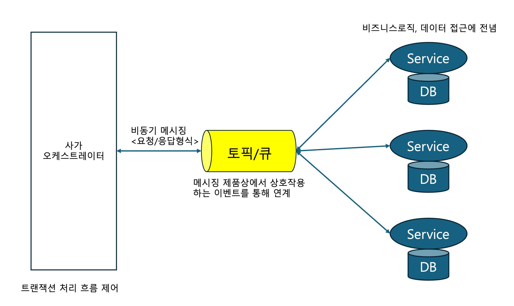
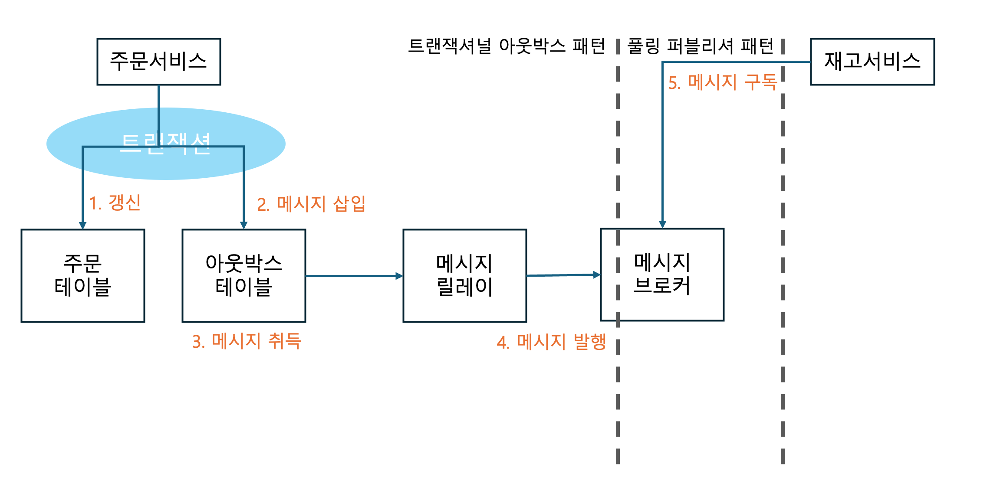

# 그림으로 공부하는 마이크로 서비스 구조
- 부제 : DX의 애플리케이션 현대화를 추진하기 위해 필요한 클라우드 네이티브 컴퓨팅의 기술 요소 
## 목차
1. 클라우드 네이티브 컴퓨팅과 마이크로 서비스 
2. 마이크로서비스 아키텍처의 기본 
   - 서비스 구조/ 레이어 아키텍처/ 헥사거널 아키텍처/ 데이터베이스 접근/ **트랜잭션 처리/ 데이터베이스 간 동기화/ 데이터 결합/ 서비스 간 연계/** 서비스화 진행 방법 
3. 마이크로서비스 패턴
   - 데이터 관리 / 트랜잭셔널 메시징 / 서비스 검색 / 외부 API / 통신 / 배포 / 관찰 가능성 / 리팩터링 패턴
4. 컨테이너, 쿠버네티스, 서버리스
5. 서비스 메시
6. 마이크로서비스의 개발과 운영
---
## 1장. 클라우드 네이티브 컴퓨팅와 MSA
### 클라우드 네이티브 컴퓨팅
- 구성 기술 요소 : 컨테이너, 컨테이너 오케스트레이션, 마이크로 서비스
  - 컨테이너 오케스트레이션 : 컨테이너 클러스터 관리 및 운영을 중심으로, 컨테이너 클러스터 배포, 이름 해결, 라우팅, 서비스 검색, 부하분산, 확장, 장애 시 자가복구 기능 제공 
- 마이크로 서비스 방식으로 애플리케이션을 개발하고, 그 애플리케이션을 컨테이너에 배포해서 실행한다. 그리고 오케스트레이션 기능을 통해 컨테이너화된 애플리케이션을 운영한다.
- 목적 
  - 확장 가능한 애플리케이션을 구축/운영하는 것
  - IT 시스템에 최소한의 인력으로 자주, 그리고 계획한 만큼 임팩트 있는 변경을 추가하는 것 
  - 비즈니스적으론 대규모 시스템을 신속하게 구축해서 시장이 필요로 하는 것을 유연하게 제공하는 것
- 참고 url
  - 클라우드 네이티브 컴퓨팅 관련 기술 정리/분류 : https://landscape.cncf.io
  - 클라우드 네이티브 트레일 맵 : https://github.com/cncf/trailmap

### 마이크로 서비스
- 서비스를 조합해서 애플리케이션을 구성하는 소프트웨어
  
- 하나의 요청(Request)를 처리하기 위해 **각 서비스는 REST나 메시징으로 통신하는 분산 컴퓨팅 환경 구성**
- 특징
  ```
  1. 서비스를 사용한 컴포넌트화
  2. 비즈니스 기능을 기준으로 한 팀 편성
  3. 프로젝트가 아닌 제품을 파악해서 개발 및 운영
  4. 지능적인 엔드포인트와 단순한 파이프
  5. 비중앙집권적인 언어와 툴 선택
  6. 비중앙집권적인 데이터 관리
  7. 인프라의 자동화
  8. 장애와 오류를 전제로 한 설계
  9. 선진적인 설계
  ```
- 장점
  ```
  - 작은 단위의 애플리케이션 릴리스
  - 빠르고 유연한 애플리케이션 변경 및 유지/관리
  - 작은 단위의 확장
  - 장애 영향을 최소화
  ```
- 운영 시 고려사항
  ```
  - 서비스 간 통신 지연
  - 분산 배치된 데이터의 동기화
  - 분산 컴퓨팅 환경의 운영 및 감시 비용
  - 시스템 전체 설계의 일관성 및 통일성
  - 서비스 모델링 기법의 학습 난이도 
  ```
## 2장. 마이크로서비스 아키텍처의 기본
### 헥사거널 아키텍처 (= 포트 및 어댑터 아키텍처)

- 기존 레이어 아키텍처에서 의존성 역전을 통해 확장성을 개선한 아키텍처
- 불특정한 데이터 입출력에 대응할 수 있도록 확장성을 가짐
- 외부 입출력과 도메인 사이에 포트,어댑터를 두어 가능한 구조
  - 포트 : 추상화된 프로그래밍 인터페이스를 도메인에 제공
  - 어댑터 : 외부 기능과 상호작용하는 역할, 외부 기능 단위로 교체하는 기능

### 데이터베이스 접근
- 마이크로서비스에서 서비스는 모델(비즈니스 데이터)를 포함한다. 
- 서비스가 자신이 포함하고 있지 않은 모델에 접근하려면 해당 모델이 속한 서비스를 거쳐서 데이터에 접근한다.
- 여러 서비스가 하나의 데이터 베이스를 공유하는 것을 막는 것.
- 이 같은 접근법은 데이터베이스 변경에 대해 유연하다. 데이터베이스를 변경하면 해당 데이터베이스를 사용하고 있는 프로그램도 변경해야 할 가능성이 높기 때문

### 트랜잭션 처리 
- 로컬 트랜잭션을 권장
- 하나의 트랜잭션 컨텍스트 (begin - commit) 내에 하나의 데이터베이스만을 처리 대상으로 한다면 해당 트랜잭션은 로컬 트랜잭션
- 글로벌 트랜잭션에 대비해 간단하고 서비스 간 약한 결합을 유지하는데 좋다

### 데이터베이스간 동기화 
- MAS 방식으로 모델링하면 애플리케이션뿐만 아니라 데이터베이스도 분산 배치된 초분산 컴퓨팅 환경이 된다.
- 이 데이터베이스들을 동기화 하려면 어떻게 해야 할까 => Saga
  
- Saga란 로컬 트랜잭션, 이벤트, 보상 트랜잭션 등의 기술 및 기법을 이용해서 리소스 간 동기화를 취하는 디자인 패턴이다. 
  - 데이터베이스 변경을 메시징 구조를 이용해서 이벤트를 전달해 차례로 변경한다.
  - 흐름 중 장애가 발생하면 장애 발생 이전에 데이터베이스에 적용한 내용을 되돌리는, 정상 처리의 반대방향으로 처리하는 것을 보상 트랜잭션이라 한다.

### 데이터 결합 
- CQRS; 명령 질의 책임 분리 
  - 데이터 접근 처리를 갱신형 처리(데이터 삽입/변경/삭제)와 참조형 처리(데이터 검색/취득)으로 구분하고
  - 각각을 구현하기 위해 독립된 서비스 컴포넌트와 데이터 저장소를 두는 디자인 패턴 
  - 일반적으로 참조형 처리는 요청량이 방대해서 빠른 응답이 중요하고, 갱신형 처리는 요청량이 그렇게 많지 않지만 안전하고 확실한 트랜잭션 완료가 요구된다.
- 이벤트 소싱
  - 갱신형 저장소와 참조형 저장소를 동기화해 주는 구조 
  - 필요에 따라 검색용 데이터 스토어를 준비하고 메시징 기반 미들웨어(MOM)의 비동기 메시징을 사용해 이벤트 소스와 검색용 데이터 저장소를 동기화 한다. 

### 서비스 간 연계
- 동기형 REST는 요청을 쌓이게 하여 서버 리소스를 고갈시켜 장애를 일으킬 가능성이 높음
- 따라서 메시징 기법을 고려해본다.
- 메시징 : MOM을 통해 게시자와 구독자가 이벤트를 주고 받는 통신 모델이다.

### 세션 정보 유지
- 모던한 소프트웨어 설계에서는 애플리케이션을 stateless하게 설계 하는 것을 추천 한다. (확장성과 가용성 측면)
- 하지만 장바구니나 로그인 기능 시, 처리 상태를 유지해야 하는 경우가 존재 한다. 이럴 때 MSA에서 세션 정보 유지를 위해 어떤 방법을 사용할까.
  - 상태의 서비스화 
    - 상태를 유지하기 위한 서비스를 신설하고, 스테이트 자체는 데이터 베이스 등의 영구 저장소에 저장 
    - 최종 사용자의 요청과 상태는 사용자 ID 등으로 연결 
    - 기존에 메모리상 휘발성 정보로 처리했던 세션 정보를 영구적인 서비스로 취급하는 것이다. 
  - 기존 세션 정보 유지 기능
    - 세션 영구화 : 처리 중인 상태를 데이터베이스 등의 영구적 데이터 저장소에 저장해 두는 기능 
    - 스티키 세션 : 처리 상태가 저장돼 있는 서버에 클라이언트 요청을 전송하는 것 
    
## 3장. 마이크로서비스 패턴 
### 데이터 관리 패턴
- 과제 : 데이터 동기화, 데이터베이스 배치 모델, 데이터 결합 
1. 데이터베이스 배치 패턴 
   - 서비스 별 데이터베이스 
     - 제품, 주문, 배송과 같은 도메인별로 데이터베이스를 만들어 (not table) 관리한다. 
     - 이를 가능 하게 하기 위해 Saga로 DB 동기화, CQRS, 이벤트소싱으로 데이터 결합하여 검색 구조 구축이 필요하다. 
   - 공유 데이터베이스 (기존방법)
     - 쇼핑몰 데이터베이스 안에 다양한 서비스를 테이블로 구축하는 방법 
     - 결과적 일관성이 허용되지 않는 비즈니스라면 위의 방법을 쓰지 못하기 때문에 사용 
2. 데이터베이스 동기화 패턴 (with Saga)
  - 코레오그래피
    - DB에 접속하는 서비스가 각각 메시징 제품을 통해서 데이터를 동기화하는 방법
    - 각 서비스 내부에는 비즈니스 로직이나 보상 트랜잭션 로직에 추가로 Saga를 성립시키기 위한 제어 로직도 구현해야 한다. 
    - 구조는 단순하나 각 서비스와 DB간 연계를 한 눈에 파악하기 어려워 고려가 필요함 
    - 
  - 오케스트레이션
    - 
    - 사가 오케스트레이터라고 하는 특별한 서비스가 트랜잭션 처리를 조율한다.
    - 트랜잭션 조율이라는 역할을 하므로 애플리케이션 계층에 배치되는 애플리케이션 서비스로 구현된다.
    - 사가 오케스트레이터는 요청/응답 형식의 비동기 메시지를 통해서 비즈니스 로직을 담당하는 도메인 게층 서비스에게 데이터 처리를 요청한다.
    - 장애시에도 오류를 감지하고 각 서비스에 보상 트랜잭션 실행을 의뢰한다. 
    - 해당 구조에서는 오케스트레이터가 사가 제어 로직을 담당하고 도메인 계층 서비스는 비즈니스 로직과 데이터 처리라는 역할을 명확히 분리할 수 있다.
    - 서비스간 흐름 제어는 오케스트레이터 내에 구현되므로 서비스와 데이터베이스 연계 흐름을 파악하기 쉽다.
    - 사가 오케스트레이터가 무거워지지 않도록 역할 분담에 대한 것을 고려 해야 한다. 
  - 어떤 방식을 선택하든 서비스 간 연계에는 메시징 제품을 사용해야 하고
  - 각 서비스에서 데이터베이스 접속과 메시징 전송을 하나의 트랜잭션 내에 끝내야 한다는 것에 유의 
  - 서비스 내의 데이터베이스와 메시징 간 일관성 => 트랜잭셔널 메시징 패턴
### 트랜잭셔널 메시징 패턴 
- 사가 구현에 필요한 이벤트 처리와 DB처리를 동기화 하려면 DB처리와 완벽하게 동기화하는 이벤트처리(메시징), 즉 트랜잭셔널 메시징이 필요하다
- 트랜잭셔널 아웃 박스 
  - 비즈니스 데이터, DB 처리를 통지하는 이벤트 발신자
  - 
### 서비스 검색 패턴 
