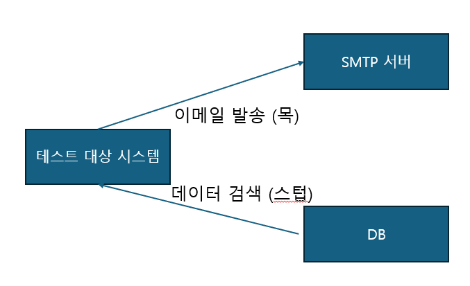

# 📒 단위테스트 - 블라디미르 코리코프
1. 단위 테스트 목표 정의 : 좋은/나쁜 테스트 구별
2. 단위 테스트 정의
3. 단위 테스트 구성, 픽스처, 테스트 매개변수
4. 좋은 단위테스트의 기준
5. mock
6. 단위 테스트의 세 가지 스타일
7. 테스트 리팩터링
8. 통합테스트
9. mock
10. 테스트와 관계형DB
11. 단위테스트 안티 패턴
---
## 단위테스트 목표
- 커버리지 지표, 분기 커버리지 : 테스트 완전성에 대해 인사이트를 얻을 수 있지만 확실한 기준이 될 순 없다. 
- 성공적인 테스트 스위트는 다음과 같은 특성을 나타낸다.
  - 개발 주기에 통합돼 있다.
  - 코드베이스 중 가장 중요한 부분만을 대상으로 한다.
  - 최소한의 유지비로 최대의 가치를 끌어낸다. 

## 단위테스트 정의 
- 작은 코드 조각을 검증
- 빠르게 수행
- 격리된 방식으로 처리하는 자동화된 테스트 
### 격리의 기준
- 런던파 : 대역 사용
  - 인스턴스를 생성하지 않고 Mock을 사용해 대체한다. 실행하지 않고 해당 가짜 인스턴스가 어떻게 동작할지 Mock에 코드로 직접 정의한다.  
  - 테스트 대상 클래스를 의존성에서 분리하면 제품 코드의 각 클래스에 대해 테스트 클래스가 하나씩 있는 구조를 확립하는데 도움이 된다. 
- 고전파 : 대역 미사용, 운영용 인스턴스 사용 
  - 의존 대상이라 만든 테스트 코드에서 에러가 나면 에러 처리가 된다 -> 테스트에서 구 클래스는 격리되어 있지 않다.
  - 그러나 단위 테스트별로 서로 분리할 수 있다는게 중점 
  - 테스트 코드 대상 단위는 코드 단위가 아니라 동작단위. 따라서 공유 의존성만 테스트 대역으로 대체 (싱글톤같은) 

## 단위테스트 구조 
1. 여러 개의 준비, 실행, 검증 구절 지양 -> 실행 구절은 한 줄로 (두 줄 이상은 캡슐화가 깨졌다는 증거)
2. 테스트 내 if문 지양 -> 테스트는 분기가 없는 간단한 일련의 단계여야 한다. if는 한 번에 많은 것을 검증한다는 표시 
3. 테스트 픽스처 : 테스트 클래스에 비공개 팩토리 메서드 
   - 테스트 대부분에 사용되는 생성자에 픽스처를 인스턴스화 할 수도 있음 

## 좋은 단위테스트의 기준
- 4대요소
  - 회귀방지 : 회귀는 코드를 수정한 후 기능이 의도한 대로 작동하지 않는 경우  -> 테스트가 가능한 한 많은 코드를 실행하는 것을 목표로 해야한다.
  - 리팩터링 내성 : 테스트를 빨갠색으로 바꾸지 않고 기본 애플리케이션 코드를 리팩터링 할 수 있는지에 대한 척도  -> SUT의 구현 세부 사항과 테스트간의 결합도를 낮춘다, 구현 세부사항이 아니라 최종 결과(비개발자들에게 의미 있는)를 검증한다.
  - 빠른 피드백
  - 유지 보수성

## 목과 스텁
- 테스트 대역 : 목 (목, 스파이) / 스텁 (스텁, 더미, 페이크)
  - 목은 외부로 나가는 상호 작용을 모방 , 사이드 이펙트 일으키는 것이 목적 , 명령을 대체 (반환 값 없음)
    ```java
    public void Sending_email() {
        vwr mock = new Mock<EmailGateWay>();
        vwr sut = new Controller(mock.Object);
    
        sut.GreetUser("user@email.com");
        mock.Verify(
         x => x.SendGreetingsEmail("user@email.com"), 
            Times.Once);
        )   
    }
    ```
  - 스텁은 내부로 들어오는 상호 작용을 모방, 사이드 이펙트 무 , 조회를 대체 (값 반환)
    ```java
    public void Creating_report() {
         var stub = new Mock<IDataBase>();
         stub.Setup(x => x.GetNumberOfUsers())
                .return(10);
         var sut = new Controller(stub.Object);
         Report report = sut.CreateReport();
         Assert.Equal(10, report.NumberOfUsers());
    }
    ```
  - 
  - stub으로는 상호작용을 검증하면 안된다.
    - 그저 출력 (최종결과)를 위한 입력으로 사용해야 한다.
    - 최종 결과를 검증해야 한다는 원칙을 지켜야 하므로.
    - 여기서 최종결과는 Mock에서 `mock.Verify(x => x.SendGreetingsEmail("user@email.com"))` 과 같은 부분이다. 