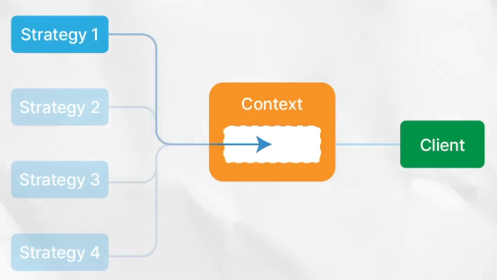

# 디자인패턴
## Facade
- 여러 요소들로 복잡하게 구성된 시스템을 하나의 창구를 통해 간단하게 사용할 수 있게 함
- 서브시스템들과 그것들을 묶는 Facade 클래스로 이루어지며 client는 Facade를 호출한다.
## Strategy Pattern
- 
- 특정 작업을 하는 방식들 '전략'을 여럿 만들어 두고 필요에 따라 갈아끼우는 패턴
- {특정 작업 : 계산}, {방식 : 현금, 카드, 카카오페이} 
- client는 작업을 생성 -> 전략을 선택(set) -> 작업 실행  
- 코드 실행 중 바꿀 수 있다 (set)
## Template Method
- 정해진 어떤 단계들을 거쳐서 실행되어야 하는 일들을 구현할 때 사용 
- 각 단계를 어떻게 수행할 것인지는 다양하게 구현가능, 반드시 이 순서에 따라 전체 과정이 실행되도록 만들어야 할 때 유용 